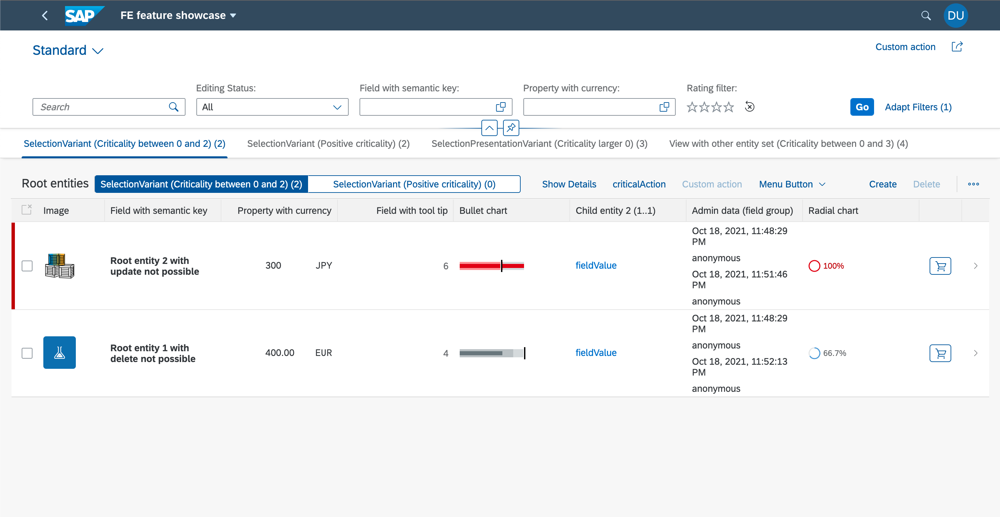

# SAP Fiori elements for OData V4 Feature Showcase 
[](https://api.reuse.software/info/github.com/SAP-samples/fiori-elements-feature-showcase)


<br/>
The main focus of this project is to present features from the List Report & Object Page floorplan. Please note, some feature combinations might not be intended by the [SAP Fiori UX Guidelines](https://experience.sap.com/fiori-design/) but are shown here for the sake of demonstration.
<br/><br/>
Start the app and search for features you might want to use or search through the content overview. When you find something you can look for the corresponding topic for more information regarding the implementation.
<br/><br/>
Some topics have a hint, that the implementation is possible using SAP Fiori tools, which we recommend to use.
<br/><br/>
If you use CAP for the first time, please follow the instructions from the [CAP Getting started](https://cap.cloud.sap/docs/get-started/) <br/> <br/>
To run the featue showcase locally install the dependencies in the [root folder](https://github.tools.sap/fiori-elements/feature-showcase) with `npm install`. <br/>
Then start the app with `cds watch`. <br/>
Open `http://localhost:4004/` in the Browser to get to the SAP Fiori launchpad sandbox from where you can navigate to the feature showcases.
<br/>

<b>Finding code: </b>Each of the following topics has search terms, to find the related code snippets in the repository.

## Content
- [List Report](#list-report)
    - [General Features](#general-features)
        - [Configure Draft](#configure-draft)
        - [Replacing Standard UI Texts](#replacing-standard-ui-texts)
        - [Custom Actions](#custom-actions)
            - [Invoking CAP actions out of a Custom Action](#invoking-cap-actions-out-of-a-custom-action)
    - [Header Area](#header-area-list-report)
        - [Enabling Variant Management](#enabling-variant-management)
        - [Define Filters](#define-filters)
            - [Default Values](#default-values)
            - [Hide filters](#hide-filters)
            - [Filter facets](#filter-facets)
            - [Selection Fields](#selection-fields)
            - [Value Help](#value-help)
            - [Dependent Filtering (Value Help)](#dependent-filtering-value-help)
            - [Custom Filter](#custom-filter)
        - [Custom Actions](#custom-actions-global-list-report)
    - [Content Area](#content-area-list-report)
        - [Configuring Tables](#configuring-tables)
            - [Actions](#actions)
                - [Side Effects of actions](#side-effects-of-actions)
                - [Value Help for action parameter](#value-help-for-action-parameter)
                - [Default Value for action parameter](#default-value-for-action-parameter)
                - [Action Drop down menu](#action-drop-down-menu)
                - [Dynamic CRUD Restrictions](#dynamic-crud-restrictions)
                - [Navigation Button](#navigation-button)
                - [Critical Actions](#critical-actions)
                - [Message Toasts](#message-toasts)
                - [Custom Actions](#custom-actions-table-list-report)
            - [Setting the Table Type](#setting-the-table-type)
            - [Multiple Views](#multiple-views)
                - [Single table mode](#single-table-mode)
                - [Multiple table mode](#multiple-table-mode)
                - [Selection Variant](#selection-variant)
                - [Selection Presentation Variant](#selection-presentation-variant)
            - [Creation Dialog](#creation-dialog)
            - [Defining the Default Sort Order](#defining-the-default-sort-order)
            - [Enabling Multiple Selection in Tables](#enabling-multiple-selection-in-tables)
            - [Handling Semantic Key Fields](#handling-semantic-key-fields)
            - [Highlighting Line Items Based on Criticality](#highlighting-line-items-based-on-criticality)
            - [Adding a Rating Indicator to a Table](#adding-a-rating-indicator-to-a-table)
            - [Adding a Progress Indicator to a Table](#adding-a-progress-indicator-to-a-table)
            - [Adding a field with a tooltip to a Table](#adding-a-field-with-a-tooltip-to-a-table)
            - [Adding a Smart Micro Chart to a Table](#adding-a-smart-micro-chart-to-a-table)
            - [Adding a Contact Quick View to a Table](#adding-a-contact-quick-view-to-a-table)
            - [Adding a Quick View Facet to a Table](#adding-a-quick-view-facet-to-a-table)
                - [Links to the apps of the entity](#links-to-the-apps-of-the-entity)
            - [Adding Multiple Fields to one Column in Responsive Tables](#adding-multiple-fields-to-one-column-in-responsive-tables)
            - [Adding Images to a table](#adding-images-to-a-table)
            - [Adding Currency or UoM Fields to a table](#adding-currency-or-uom-fields-to-a-table)
            - [Add custom column (Extensibility)](#add-custom-column-extensibility)
- [Object Page](#object-page)
    - [General Features](#general-features-object-page)
        - [Annotations for data fields](#annotations-for-data-fields)
            - [Communication properties](#communication-properties)
            - [Time and Date](#time-and-date)
            - [Multi line text](#multi-line-text)
            - [Placeholder values](#placeholder-values)
        - [Replacing Standard UI Texts](#replacing-standard-ui-texts)
        - [Custom Actions](#custom-actions)
            - [Invoking CAP actions out of a Custom Action](#invoking-cap-actions-out-of-a-custom-action)
    - [Header Area](#header-area-object-page)
        - [Title and Subtitle](#title-and-subtitle)
        - [Actions](#object-page-actions)
            - [Custom Actions](#custom-actions-object-page-header)
        - [Header Facets](#header-facets)
            - [Plain Text](#plain-text)
            - [Header Field Group Facet](#header-field-group-facet)
                - [Custom Field](#custom-field)
            - [Address facet](#address-facet)
            - [Data Points](#data-points)
                - [Rating](#rating)
                - [Progress](#progress)
                - [Key value](#key-value)
            - [Micro chart facet](#micro-chart-facet)
                - [Area Micro Chart](#area-micro-chart)
                - [Bullet Micro Chart](#bullet-micro-chart)
                - [Radial Micro Chart](#radial-micro-chart)
                - [Line Micro Chart](#line-micro-chart)
                - [Column Micro Chart](#column-micro-chart)
                - [Harvey Micro Chart](#harvey-micro-chart)
                - [Stacked Bar Micro Chart](#stacked-bar-micro-chart)
                - [Comparison Micro Chart](#comparison-micro-chart)
            - [Header Custom Facet](#Header-custom-facet)
    - [Content Area](#content-area-object-page)
        - [General features](#general-features-content-area-object-page)
            - [Displaying Text and ID for Value help Input fields](#displaying-text-and-id-for-value-help-input-fields)
            - [Hiding features](#hiding-features)
            - [Preview](#preview)
            - [Side Content](#side-content)
        - [Forms](#forms)
            - [Connected Fields](#connected-fields)
            - [Custom Content](#custom-content)
            - [Form Actions and Navigation](#form-actions-and-navigation)
                - [Custom Actions](#custom-actions-object-page-section-form)
        - [Table](#table)
            - [Enable Variant Management](#enable-variant-management-object-page)
            - [Enable Personalization (Filter, Sort, Columns)](#enable-personalization)
            - [Enable Full Screen Mode](#enable-full-screen-mode)
            - [Adding Titles to Object Page Tables](#adding-titles-to-object-page-tables)
            - [Adding Segmented Buttons to a Table Toolbar](#adding-segmented-buttons-to-a-table-toolbar)
            - [Enabling Inline Creation of Table Entries on Object Page](#enabling-inline-creation-of-table-entries-on-object-page)
            - [Using the 'Export to Spreadsheet' Feature](#using-the-export-to-spreadsheet-feature)
            - [Custom Actions](#custom-actions-object-page-section-table)
        - [Chart](#chart)
        - [Custom Section and Subsection](#custom-section-and-subsection)
            - [Custom Subsection](#custom-subsection)
    - [Footer Bar](#footer-bar)
        - [Determining actions](#determining-actions)
        - [Custom Actions](#custom-actions-object-page-footer)
    - [Custom Object Page](#custom-object-page)

<br/>

# [List Report](https://experience.sap.com/fiori-design-web/list-report-floorplan-sap-fiori-element/)

## General Features

### Flexible Column Layout
The Flexible Column Layout (FCL) enables the app, to display the Object Page and possibly a further Object Page next to the List Report on the same page instead of navigating to the next page.
To enable the Flexible Column Layout please use the Application Modeler from the SAP Fiori tools. The setting can be found in the Global Page Settings, which are part of the Page Map.
<!---### Configuring Navigation --->

### Configure Draft

<i>Search term:</i> [`#Draft`](../../search?q=Draft)

The annotation `@odata.draft.enabled` adds the draft mode to an entity.

```
annotate service1.RootEntities with @odata.draft.enabled;
```

### Replacing Standard UI Texts

<i>Search term:</i> [`"enhanceI18n"`](../../search?q=enhanceI18n)

If wanted, the replacement of standard UI texts is possible.
For this a new i18n file is needed, for example "customI18N.properties" which is then referenced in the [manifest.json](app/featureShowcase/webapp/manifest.json) file.

```
"RootEntityListReport": {
    ...
    "options": {
        "settings": {
            ...
            "enhanceI18n": "i18n/customI18N.properties",
            ...
        }
    }
},
```
The replacement can be for all entities, for specific entities or for specific actions of specific entities. <br/>
- `C_COMMON_DIALOG_OK` is the key for all entities.
- `C_TRANSACTION_HELPER_OBJECT_PAGE_CONFIRM_DELETE_WITH_OBJECTTITLE_SINGULAR|RootEntities` is the key for the "RootEntities" entity
- `C_OPERATIONS_ACTION_CONFIRM_MESSAGE|RootEntities|criticalAction` is the key for the "criticalAction" action of the "RootEntities" entity

```
C_COMMON_ACTION_PARAMETER_DIALOG_CANCEL|RootEntities = Custom cancel text
```

More information about replacing standard UI texts and what can be overridden is available in the [SAP Fiori elements Documentation](https://sapui5.hana.ondemand.com/#/topic/b8cb649973534f08a6047692f8c6830d).

### Custom Actions

<i>Search term:</i> [`CustomActions`](../../search?q=CustomActions)

With extensions points it is possible to add custom front-end actions to the UI at different places. Custom actions are added to the [manifest.json](app/featureShowcase/webapp/manifest.json) file. The location depends on where the action shall be visible on the UI.
In general a custom action consists of a unique qualifier for the action. The property "press" is the path to the event handler in a JavaScript file. Both the "enabled" and "visible" property accept either static values (true/false), a binding path, like in the example, or another path to a JavaScript function which returns true or false. The "text" property is the label of the button.

```
"CustomActionSection" : {
    "press": "sap.fe.featureShowcase.mainApp.ext.CustomActions.messageBox",
    "enabled": "{= ${ui>/editMode} !== 'Editable'}",
    "visible" : true,
    "text": "{i18n>CustomActionSection}"
}
```

The following code snippet is the [CustomActions.js](app/featureShowcase/webapp/ext/CustomActions.js) file from the example. "enabled" and "enabledForSingleSelect" are possible functions for the "enabled" property.
```
sap.ui.define([
	"sap/m/MessageBox",
	"sap/ui/core/library"
], function(MessageBox, coreLibrary) {
    "use strict";

    return {
        messageBox: function() {
            MessageBox.alert("Button pressed");
        },
        enabled : function() {
            return true;
        },
        enabledForSingleSelect: function(oBindingContext, aSelectedContexts) {
            if (aSelectedContexts && aSelectedContexts.length === 1) {
               return true;
            }
            return false;
         }
    };
});
```

#### Invoking CAP actions out of a Custom Action

<i>Search term:</i> [`#EditFlowAPI`](../../search?q=EditFlowAPI)

It is also possible to invoke CAP actions out of a JavaScript function using the "invokeAction" function of the SAP Fiori elements Edit flow API.
```
sap.ui.define([
	"sap/m/MessageBox",
	"sap/ui/core/library"
], function(MessageBox, coreLibrary) {
    "use strict";
    return {
		onChangeCriticality: function(oEvent) {
			let sActionName = "service1.changeCriticality";
			let mParameters = {
				contexts: oEvent.getSource().getBindingContext(),
				model: oEvent.getSource().getModel(),
				label: 'Confirm',	
				invocationGrouping: true 	
			};
			this.editFlow.invokeAction(sActionName, mParameters); //SAP Fiori elements EditFlow API
		},
        ...
    };
});
```

## Header Area List Report

### Enabling Variant Management

<i>Search term:</i> [`"variantManagement"`](../../search?q=variantManagement)

Variant Management (saving the filter settings and the personalization of tables) is by default enabled. However with the annotation `"variantManagement": "None"` it can be disabled in the [manifest.json](app/featureShowcase/webapp/manifest.json).
```
"RootEntityListReport": {
    ...
    "options": {
        "settings": {
            "entitySet": "RootEntities",
            "variantManagement": "None",
            ...
        }
    }
}
```
When the Variant Management is disabled, the App title will be shown instead at this place. With the `subTitle` annotation in the [manifest.json](app/featureShowcase/webapp/manifest.json) file, you can change that to a custom name. The corresponding name for the property `appSubTitle` has to be in the [i18n.properties](app/featureShowcase/webapp/i18n/i18n.properties) file within the webapp folder of the app.
```
"sap.app": {
    ...
    "subTitle": "{{appSubTitle}}",
    ...
}
```

### Define Filters
<i>Search term:</i> [`#FilterDefault`](../../search?q=FilterDefault), [`#HideFilter`](../../search?q=HideFilter),[`#FilterGrouping`](../../search?q=FilterGrouping), [`#VisibleFilters`](../../search?q=VisibleFilters), `#ValueHelps`, [`#DependentFilter`](../../search?q=DependentFilter)

#### Default Values
<i>Search term:</i> [`#FilterDefault`](../../search?q=FilterDefault)

With the annotation `@Common.FilterDefaultValue` default values can be defined, like in [field-control.cds](app/featureShowcase/field-control.cds). This Annotation does not allow complex values and when switching variants, the annotation is no longer considered. For complex values the [UI.SelectionVariant](#selection-variant) annotation is a better solution.
More information are available in the [SAP UI5 Dokumentation](https://sapui5.hana.ondemand.com/#/topic/f27ad7bc1f9c4b0d947b1fb18c37e94c)
#### Hide filters
<i>Search term:</i> [`#HideFilter`](../../search?q=HideFilter)

To reduce the amount of available filters in a List Report, properties can be annotated with `@UI.HiddenFilter` to hide them. An example is in the file [field-control.cds](app/featureShowcase/field-control.cds).
```
annotate service1.RootEntities {
    ...
    areaChartDeviationLowerBoundValue @UI.HiddenFilter;
    areaChartDeviationUpperBoundValue @UI.HiddenFilter;
    areaChartToleranceLowerBoundValue @UI.HiddenFilter;
    areaChartToleranceUpperBoundValue @UI.HiddenFilter;
    ...
};
```

#### Filter facets
<i>Search term:</i> [`#FilterGrouping`](../../search?q=FilterGrouping)

Another nice feature are `@UI.FilterFacets`, which allow one to structure the available properties of the entity into groups, so that filter adaptation is easier.
```
annotate service.RootEntities with @(
    UI.FilterFacets : [
        {
            Target : '@UI.FieldGroup#chartData',
            Label : '{i18n>chartData}',
        },
        {
            Target : '@UI.FieldGroup#location',
            Label : '{i18n>location}',
        },
    ],
);
annotate service.RootEntities with @(
    UI.FieldGroup #chartData : {
        Data  : [
            {Value : integerValue},
            {Value : targetValue},
            {Value : forecastValue},
            {Value : dimensions},
            {Value : integerValue},
        ]
    },
);
```
The implementation is in the [layout.cds](app/featureShowcase/layout.cds) file.
#### Selection Fields
<i>Search term:</i> [`#VisibleFilters`](../../search?q=VisibleFilters)

`@UI.SelectionFields` is the annotation, which allows to specify an array of fields, which should by default be shown in the List Report filter bar as a filter, so that the user does not need to adapt the filters. The annotation is used in the [layout.cds](app/featureShowcase/layout.cds) file.
```
annotate service.RootEntities with @(
    UI.SelectionFields : [
        field,
        fieldWithPrice,
        criticality_code,
    ],
);
```
Further information are available in the [UI5 Dokumentation](https://sapui5.hana.ondemand.com/#/topic/4de40b31324e4876a8421f6f642e0140).
#### Value Help
<i>Search term:</i> [](../../search?q=)`#ValueHelps`

While CAP delivers the value help for Code Lists out of the box. For other associations this is not the case. To get a value help for a filter (and for the corresponding field on the Object Page), the entity has to be annotated with `@Common.ValueList`. 
```
annotate schema.RootEntities with{
    ...
    contact @(Common : {
        Text            : contact.name,
        TextArrangement : #TextOnly,
        ValueList       : {
            Label          : '{i18n>customer}',
            CollectionPath : 'Contacts',
            Parameters     : [
                {
                    $Type             : 'Common.ValueListParameterInOut',
                    ValueListProperty : 'ID',
                    LocalDataProperty : contact_ID
                },
                {
                    $Type: 'Common.ValueListParameterDisplayOnly',
                    ValueListProperty: 'country_code',
                },
                {
                    $Type: 'Common.ValueListParameterDisplayOnly',
                    ValueListProperty: 'city',
                }
                
            ]
        }
    });
    ...
};
```
The `Label` property will be shown as the title of the value help dialog und the `CollectionPath` property refers to the entity set of the service, which provides the values for the value help. If the value help is more complex and property names do not match or you want to configure, which fields should be visible in the value help, you can provide parameters to the `Parameters` property.
For smaller collections of possible values in the value help, it might be a good idea to have a dropdown instead of a dialog to choose the value. This can be achieved with the `@Common.ValueListWithFixedValues` annotation.
The implementation is in the [value-helps.cds](app/featureShowcase/value-helps.cds) file.
#### Dependent Filtering (Value Help)
<i>Search term:</i> [`#DependentFilter`](../../search?q=DependentFilter)

Dependent filtering can be achieved with an input parameter for the value help. An example would be with countries and regions. The value help for the region should only show regions of the selected country, which is another property of the entity.
```
annotate schema.RootEntities with{
    ...
    region @(Common : {
        Text            : region.name,
        TextArrangement : #TextFirst,
        ValueListWithFixedValues: true,
        ValueList       : {
            Label          : '{i18n>Region}',
            CollectionPath : 'Regions',
            Parameters     : [
                {
                    $Type             : 'Common.ValueListParameterInOut',
                    ValueListProperty : 'code',
                    LocalDataProperty : region_code
                },
                {
                    $Type: 'Common.ValueListParameterOut',
                    ValueListProperty: 'name',
                    LocalDataProperty : region.name,
                },
                //To only show the connected values
                {
                    $Type : 'Common.ValueListParameterFilterOnly',
                    ValueListProperty : 'country_code',
                },
                {
                    $Type : 'Common.ValueListParameterIn', //Input parameter used for filtering
                    LocalDataProperty : country_code,
                    ValueListProperty : 'country_code',
                },
                
            ]
        }
    });
};
```
Here the region property (which is an Association to a Code List) is annotated with the `ValueList` annotation. To achieve the filtering, the country_code property from the header is mapped against the country_code property of the region via the `Common.ValueListParameterIn` parameter. The implementation can be found in the [value-helps.cds](app/featureShowcase/value-helps.cds#L71).


#### Custom Filter

<i>Search term:</i> [`customFilter`](../../search?q=customFilter)

Custom filter are useful, when the data value is in a special format, for example a rating. The implementation consists of multiple parts.
First List Report in the [manifest.json](app/featureShowcase/webapp/manifest.json) is extended with the following lines.
Under "controlConfiguration" the selection fields ("@com.sap.vocabularies.UI.v1.SelectionFields") are extended.
The "property" property is the property of the entity set, which is filtered. The "template" property leads to a XML fragment, which is the filter.
A "position" property with "placement" and "anchor" is also possible. When not given, the custom filter is placed at the end.
The name of the custom filter has to be the property name, else it would cause errors.
```
"RootEntityListReport": {
    ...
    "options": {
        "settings": {
            ...
            "controlConfiguration": {
                ...
                "@com.sap.vocabularies.UI.v1.SelectionFields": {
                    "filterFields": {
                        "starsValue": {
                            "label": "{i18n>customFilter}",
                            "property": "starsValue",
                            "template": "sap.fe.featureShowcase.mainApp.ext.CustomFilter-Rating"
                        }
                    }
                }
            },
            ...
        }
    }
},
```

The recommended way is to bind the filter value directly with `value="{path: 'filterValues>', type: 'sap.fe.macros.filter.type.Value'}"` and using a filter value type (Value or Range for example).
Additionally format options are possible to use another operator instead of the default 'EQ'.
```
<core:FragmentDefinition xmlns:core="sap.ui.core" xmlns="sap.m" xmlns:l="sap.ui.layout">
	<!-- Search-Term: "customFilter" -->
	<HBox alignItems="Center" core:require="{handler: 'sap/fe/featureShowcase/mainApp/ext/CustomFilter-Rating'}" width="100%" >
			<!--     Example for adapting the used operator, using GT (greater than) instead of default EQ -->
			<RatingIndicator
				id="MyCustomRatingIndicatorId" maxValue="4" class="sapUiTinyMarginBegin"
				value="{path: 'filterValues>', type: 'sap.fe.macros.filter.type.Value', formatOptions: { operator: 'GE' }}"
			/>
			<core:Icon src="sap-icon://reset" press="handler.onReset" class="sapUiSmallMarginBegin" />
	</HBox>
</core:FragmentDefinition>
```

The following code is an example for a reset function. "starsValue" is the property name of the entity set which is filtered.
```
sap.ui.define(["sap/ui/model/Filter", "sap/ui/model/FilterOperator"], function(Filter, FilterOperator) {
	"use strict";
	return {
		onReset: function(oEvent) {
			this.setFilterValues("starsValue");
		}
	};
});
```

More information regarding custom filter are in the [SAP Fiori elements Documentation](https://sapui5.hana.ondemand.com/#/topic/5fb9f57fcf12401bbe39a635e9a32a4e).

### Custom Actions (Global List Report)
<i>Search term:</i> [`"CustomActionLRGlobal"`](../../search?q=CustomActionLRGlobal)

With extension points custom actions can be added in the header area of the List Report.

```
"RootEntityListReport": {
    ...
    "options": {
        "settings": {
            ...
            "content" : {
                "header" : {
                    "actions" : {
                        "CustomActionLRGlobal" : {
                            "press": "sap.fe.featureShowcase.mainApp.ext.CustomActions.messageBox",
                            "enabled": "sap.fe.featureShowcase.mainApp.ext.CustomActions.enabled",
                            "visible" : true,
                            "text": "{i18n>CustomActionLRGlobal}"
                        }
                    }
                }
            }
        }
    }
},
```

The custom action itself is described here: [Custom Actions](#custom-actions)

## Content Area List Report
### Configuring Tables
#### Actions
<i>Search term:</i> [`#UnboundAction`](../../search?q=UnboundAction), [`#BoundAction`](../../search?q=BoundAction), [`#SideEffect`](../../search?q=SideEffect), [`#ValueHelpParameter`](../../search?q=ValueHelpParameter), [`"MenuActions"`](../../search?q=MenuActions), [`#DynamicCRUD`](../../search?q=DynamicCRUD)

In CAP, actions can be bound to a specific entity or unbound and just be a part of the service. Bound actions can only be executed, when at least one entity is selected. Unbound actions can be executed anytime.
If an action shall be visible, the `UI.DataFieldForAction` has to be added to the `UI.LineItem` annotation of the table. The action is called through the service.
```
annotate service.RootEntities with @(
    UI.LineItem : {
        $value : [
            ...
            {
                $Type : 'UI.DataFieldForAction',
                Action : 'service1.changeCriticality',
                Label : '{i18n>changeCriticality}',
            },
            ...
        ],
        ...
    },
);
``` 
[layouts_RootEntities.cds](app/featureShowcase/layouts_RootEntities.cds)
With this default annotation, the action is displayed above the table on the right, with other possible actions. If you want to display the action inline, the property `Inline : true` has to be added. Additionally instead of the action name, an icon can be displayed, if the action is in line.
```
annotate service.RootEntities with @(
    UI.LineItem : {
        $value : [
            ...
            {
                $Type : 'UI.DataFieldForAction',
                Action : 'service1.changeProgress',
                Label : '{i18n>changeProgess}',
                IconUrl : 'sap-icon://status-critical',
                Inline : true,
            },
            ...
        ],
        ...
    },
);
```
While you can add the property `Determining : true`, determining actions are not supported and the action will just disappear from the UI. <br/> The action annotations so far were for bound actions. If you want to add unbound actions, you have to change the action annotation slightly. Instead of referring to `service1.unboundAction` you have to refer to `service1.EntityContainer/unboundAction` in order to have a working unbound action. The other path will display an action on the UI, but it would not work, if you click it.
```
annotate service.RootEntities with @(
    UI.LineItem : {
        $value : [
            ...
            {
                $Type : 'UI.DataFieldForAction',
                Action : 'service1.EntityContainer/unboundAction',
                Label : '{i18n>unboundAction}',
            },
            ...
        ],
        ...
    },
);
```
##### Side Effects of actions
<i>Search term:</i> [`#SideEffect`](../../search?q=SideEffect)

If your action triggers changes on the entities, you need side effects so that the UI updates automatically. These side effect annotations have to be added to the action.
```
entity RootEntities as select from persistence.RootEntities actions {
    ...
    @(
        cds.odata.bindingparameter.name : '_it',
        Common.SideEffects              : {
            TargetProperties : ['_it/integerValue']
        }
    )
    action changeProgress (@(title : '{i18n>newProgress}', UI.ParameterDefaultValue : 50)newProgress : Integer);
};
```
The OData binding parameter is needed, in order to refer to the fields of the entity, which need to be updated. These fields are then listed in the array of the `TargetProperties` property of `@Common.SideEffects`.
##### Value Help for action parameter
<i>Search term:</i> [`#ValueHelpParameter`](../../search?q=ValueHelpParameter)

Often properties of an entity have value helps, so that creating a new entity is easier and wrong inputs are reduced. Value helps for action parameters are also possible.
```
entity RootEntities as select from persistence.RootEntities actions {
    ...
    action changeCriticality (
        @(
            title         : '{i18n>newCriticality}',
            UI.ParameterDefaultValue : 0,
            Common        : {
                ValueListWithFixedValues : true,
                ValueList : {
                    Label          : '{i18n>Criticality}',
                    CollectionPath : 'Criticality',
                    Parameters     : [
                    {
                        $Type             : 'Common.ValueListParameterInOut',
                        ValueListProperty : 'code',
                        LocalDataProperty : newCriticality
                    },
                    {
                        $Type             : 'Common.ValueListParameterDisplayOnly',
                        ValueListProperty : 'name'
                    },
                    ]
                }
            }
        )
        newCriticality : Integer);
    ...
};
```
This can be achieved, by just annotating the parameter with a common valueList. The annotation has to be inline with the parameter.

##### Default Value for action parameter
<i>Search term:</i> [`#ParameterDefaultValue`](../../search?q=ParameterDefaultValue)

With the annotation `@UI.ParameterDefaultValue` a default value for the parameter is set.
```
entity RootEntities as select from persistence.RootEntities actions {
    ...
    action changeProgress (@(title : '{i18n>newProgress}', UI.ParameterDefaultValue : 50)newProgress : Integer);
};
```

##### Action Drop down menu
<i>Search term:</i> [`"MenuActions"`](../../search?q=MenuActions)

A dropdown menu to group actions is possible with an annotation in the [manifest.json](app/featureShowcase/webapp/manifest.json) file.
```
"RootEntityListReport": {
    ...
    "options": {
        "settings": {
            ...
            "controlConfiguration": {
                "@com.sap.vocabularies.UI.v1.LineItem": {
                    "actions": {
                        "MenuActions": {
                            "text": "{i18n>MenuButton}",
                            "menu": [
                                "DataFieldForAction::service1.changeCriticality",
                                "DataFieldForAction::service1.EntityContainer::unboundAction"
                            ]
                        }
                    },
                    ...
                },
                ...
            }
        }
    }
},
```
In the control configuration of the List Report, the line item annotation of the table (it does not affect other line item definitions which may be used in other table views) has a property `"actions"` under which the menu button needs to be added. `"MenuActions"` is in this case just the identifier of this specific menu button. The text property is the actual label of the menu button and the `"menu"` property contains all actions, which should be included. "changeCriticality" is a bound action and can be directly accessed through the service. The unbound action on the other side, needs to be accessed through the EntityContainer. The slash is replaced with two colons in the identifier for the action.
##### Dynamic CRUD Restrictions
<i>Search term:</i> [`#DynamicCRUD`](../../search?q=DynamicCRUD)

The visibility of the "Edit", "Create" and "Delete" actions can be dynamically adjusted. For example the delete operation can be dependent on a field of the entity, through the annotation `@Capabilities.DeleteRestrictions`. Fixed values are also possible.
```
annotate service1.RootEntityVariants with @(
    Capabilities.DeleteRestrictions : {
        Deletable : deletePossible,
    },
    UI.UpdateHidden : updateHidden
);
```
[capabilities.cds](app/featureShowcase/capabilities.cds)

While `@Capabilities.UpdateRestrictions` would restrict the update possibilities of the entity in the edit mode, e.g. all fields are read only, the "Edit" button would not disappear. Instead the `@UI.UpdateHidden` annotation should be used, which when true, hides the "Edit" button as intended.

##### Navigation Button
<i>Search term:</i> [`#NavAction`](../../search?q=NavAction)

A navigation action navigating to an associated entity can be added, through adding the `UI.DataFieldForIntentBasedNavigation` as a line item.
```
annotate service.RootEntities with @(
    UI.LineItem : {
        $value : [
            ...
            {
                $Type : 'UI.DataFieldForIntentBasedNavigation',
                Label : '{i18n>inboundNavigation}',
                SemanticObject : 'FeatureShowcaseChildEntity2',
                Action : 'manage',
                RequiresContext : true,
                Inline : true,
                IconUrl : 'sap-icon://cart',
                Mapping : [
                    {
                        $Type : 'Common.SemanticObjectMappingType',
                        LocalProperty : integerValue,
                        SemanticObjectProperty : 'integerProperty',
                    },
                ],
                ![@UI.Importance] : #High,
            },
            ...
        ],
        ...
    },
);
```
[layouts_RootEntities.cds](app/featureShowcase/layouts_RootEntities.cds) <br/>

The semantic object and the action are in the [fiori.html](app/fiori.html) file. The application property in this contains the following code snippet:
```
"FeatureShowcaseChildEntity2-manage": {
    title: "ChildEntities2",
    description:"Manage",
    additionalInformation: "SAPUI5.Component=sap.fe.featureShowcase.childEntities2ui",
    applicationType: "URL",
    url: "/featureShowcaseNavigationTarget/webapp",
    navigationMode: "embedded",
},
```
Here "FeatureShowcaseChildEntity2" is the semantic object to be referenced. The second part of the name is the action of the app. As an example you may have the apps "SalesOrder-manage", "SalesOrder-view" and so on. Semantic object and action have to be divided by a dash.
The property `RequiresContext` determines, whether an entry needs to be selected to enable the navigation button or not. If it is set to true, it may be needed, to add the `Mapping` property. This property is an array of mappings between local and semantic object properties and it is needed if local properties should be used to filter in the app of the semantic object, but the property names differ. In this example, the local property 'integerValue' is mapped to the semantic object property 'integerProperty', so when selecting an entity where integerValue equals 22, the navigation would filter for entries where the 'integerProperty' property equals 22 in the semantic object app.  
Icons can be displayed as the label of the button instead of text, but only if the button is inline. When Icons are displayed, the criticality is being ignored.

##### Critical Actions
<i>Search term:</i> [`#CriticalAction`](../../search?q=CriticalAction)

When an action is annotated with `@Common.IsActionCritical : true`, a popover will appear before invoking the action, asking the user if he/she is sure about invoking the selected action.

```
annotate service1.criticalAction with @(
    Common.IsActionCritical : true
);
```

##### Message Toasts
<i>Search term:</i> `#MessageToast`

Message toasts are shown on the UI when the Backend sends a message with the severity equaling 1. If the severity is higher, a dialog will be shown.
For more information regarding the sending of messages from a CAP Backend, please have a look at the [SAP CAP Documentation for messaging](https://cap.cloud.sap/docs/node.js/events#req-msg).

```
req.notify(`Critical action pressed`);
```
`notify` is the method to send a message with the severity of 1 and `req` is the request received by CAP.

##### Custom Actions (Table List Report)
<i>Search term:</i> [`"CustomActionLR"`](../../search?q=CustomActionLR)

With extension points custom actions can be added in the table toolbar of the List Report.

```
"RootEntityListReport": {
    ...
    "options": {
        "settings": {
            ...
            "controlConfiguration": {
                "@com.sap.vocabularies.UI.v1.LineItem": {
                    "actions": {
                        ...
                        "CustomActionLR" : {
                            "press": "sap.fe.featureShowcase.mainApp.ext.CustomActions.messageBox",
                            "enabled": "sap.fe.featureShowcase.mainApp.ext.CustomActions.enabledForSingleSelect",
                            "visible" : true,
                            "text": "{i18n>CustomActionLR}"
                        }
                    },
                    ...
                }
            },
            ...
        }
    }
},
```

The custom action itself is described here: [Custom Actions](#custom-actions-list-report)

#### Setting the Table Type

<i style="color:orange;">INFO: </i>We recommend that you use [SAP Fiori tools](http://help.sap.com/disclaimer?site=https://help.sap.com/viewer/product/SAP_FIORI_tools/Latest/en-US), which is a set of extensions for SAP Business Application Studio and Visual Studio Code, to configure the app using the Application Modeler tool. <br/>
<i>Search term:</i> [`"tableSettings"`](../../search?q=tableSettings), [`"ResponsiveTable"`](../../search?q=ResponsiveTable), [`"GridTable"`](../../search?q=GridTable)

Supported table types are the <i>ResponsiveTable</i> and the <i>GridTable</i>. The table type of the List Report can be adjusted in the [manifest.json](app/featureShowcase/webapp/manifest.json) file (Line 146).
```
"RootEntityListReport": {
    ...
    "options": {
        "settings": {
            ...
            "controlConfiguration": {
                "@com.sap.vocabularies.UI.v1.LineItem": {
                    ...
                    "tableSettings": {
                        "type": "ResponsiveTable",
                        ...
                    },
                    ...
                },
                ...
            },
            ...
        }
    }
},
```

#### Multiple Views
<i>Search term:</i> [`#multipleViews`](../../search?q=`#multipleViews`), [`"views"`](../../search?q=views), `[`#multipleViews`](../../search?q=`#multipleViews`), ["quickVariantSelection"`](../../search?q=quickVariantSelection)

With multiple views, you can display different selections and/or presentations of the entity set, without the need to set the filter manually. 
##### Single table mode
<i>Search term:</i> [`"quickVariantSelection"`](../../search?q=quickVariantSelection)

In the single table mode all views are displayed in the same table. You can switch between the views through a segmented button next to the table title. If you define more than three views, a drop down menu will be displayed instead. A restriction of the single table mode is, that you can change the selected entities (`@UI.SelectionVariant`), but not the presentation (`@UI.SelectionPresentationVariant`) of the entities, nor the entity set itself.
To implement the single table mode, you need to define a selection variant and refer to it in the manifest.json file, through using its qualifier (e.g. #variant1).
```
"RootEntityListReport": {
    ...
    "options": {
        "settings": {
            ...
            "controlConfiguration": {
                "@com.sap.vocabularies.UI.v1.LineItem": {
                    ...
                    "tableSettings": {
                        ...
                        "quickVariantSelection": {
                            "paths": [
                                {
                                    "annotationPath": "com.sap.vocabularies.UI.v1.SelectionVariant#variant1"
                                },
                                {
                                    "annotationPath": "com.sap.vocabularies.UI.v1.SelectionVariant#variant2"
                                }
                            ],
                            "hideTableTitle": false,
                            "showCounts": true
                        }
                    },
                    ...
                },
                ...
            },
            ...
        }
    }
}
```
Further you can define, if each view should show the amount of rows it displays and if the table title should be hidden for all views. By default the `"showCounts"` property is false, as additional $count requests impact the performance.

##### Multiple table mode
<i>Search term:</i> [`"views"`](../../search?q=views)

In multiple table mode, a icon tab bar will be rendered above the table to switch between the views. Each view has its own table with its own table tool bar and variant management (if activated), but only the table of the selected tab will be shown. Here you have the possibility to use the `@UI.SelectionPresentationVariant` annotation and there is the possibility to define another entity set to be displayed in a tab.
The single and multiple table mode do not exclude each other completely. When using a SelectionVariant as the annotation for a view of the multiple table mode, the different views of the single table mode can be additionally applied. When using a `UI.SelectionPresentationVarian` in the multiple table mode for the view, you cannot apply the view from the single table mode.
To implement the multiple table mode, you need to refer to the Selection- or SelectionPresentationVariants via the qualifier in the [manifest.json](app/featureShowcase/webapp/manifest.json) file. Each view has to have a unique `"key"` property for the tab. The `"annotationPath"` property refers to the qualifier. There is again the option to display the counts of each view, but it affects the performance.
```
"RootEntityListReport": {
    ...
    "options": {
        "settings": {
            ...
            "views": {
                "paths": [
                    {
                        "key": "tab1",
                        "annotationPath": "com.sap.vocabularies.UI.v1.SelectionVariant#variant1"
                    },
                    {
                        "key": "tab2",
                        "annotationPath": "com.sap.vocabularies.UI.v1.SelectionVariant#variant2"
                    },
                    {
                        "key": "tab3",
                        "annotationPath": "com.sap.vocabularies.UI.v1.SelectionPresentationVariant#SelectionPresentationVariant"
                    },
                    {
                        "key": "tab4",
                        "entitySet": "RootEntityVariants",
                        "annotationPath": "com.sap.vocabularies.UI.v1.SelectionVariant#variant3"
                    }
                ],
                "showCounts": false
            },
            ...
        }
    }
}
```
When you want to have a view with a different entity set, you just need to add the `"entitySet"` property to a path entry in the [manifest.json](app/featureShowcase/webapp/manifest.json). The referenced entity name equals the entity name in the CAP Service. The Selection- or SelectionPresentationVariant has to be annotated to the different entity set. When displaying a different entity set, the counts of each view will be automatically shown, ignoring the `showCounts` annotation. Filters from the main entity set will be applied, when the property exist in the other entity set, else they will be ignored. There is no option to add filters for unique properties of the other entity set. 
More information are available in the [SAP UI5 Documentation](https://sapui5.hana.ondemand.com/#/topic/b6b59e4a4c3548cf83ff9c3b955d3ba3).

##### Selection Variant
<i>Search term:</i> [`#SVariant`](../../search?q=SVariant)

With a selection variant, you can define how the fields of an entity set should be sorted. The "Text" property is the title of the view and the property "SelectOptions" contains all sorting parameters.
```
annotate service.RootEntities with @(
    UI.SelectionVariant #variant1 : {
        Text : '{i18n>SVariant1}',
        SelectOptions : [
            {
                PropertyName : criticality_code,
                Ranges : [
                    {
                        Sign : #I,
                        High : 2,
                        Option : #BT,
                        Low : 0,
                    },
                ],
            },
        ],
    },
    ...
);
```
The "Option" property supports the following options: Equal To (EQ), Between (BT), Less than or equal to (LE), Greater than or equal to (GE), Not equal to (NE), Greater than (GT) and Less than (LT).
The annotations are in the [layouts_RootEntities.cds](app/featureShowcase/layouts_RootEntities.cds) file.

##### Selection Presentation Variant
<i>Search term:</i> [`#SPVariant`](../../search?q=SPVariant)

With a selection presentation variant a selection of entities and a presentation can be defined. The `PresentationVariant` currently supports the properties `SortOrder` and `Visualizations`. The selection and presentation variants are basically identical to their stand-alone counterparts, only the selection variant here does not include the text property.
```
annotate service.RootEntities with @(
    UI.SelectionPresentationVariant #SelectionPresentationVariant : {
        Text : '{i18n>SelectionPresentationVariant}',
        SelectionVariant : {
            $Type : 'UI.SelectionVariantType',
            SelectOptions : [
                {
                    PropertyName : criticality_code,
                    Ranges : [
                        {
                            Sign : #I,
                            Option : #GT,
                            Low : 0,
                        },
                    ],
                },
            ],
        },
        PresentationVariant :{
            SortOrder : [
                {
                    Property : fieldWithPrice,
                    Descending : false,
                },
            ],
            Visualizations : [
                '@UI.LineItem#simplified',
            ],
        },
    },
);
```
You can refer to a specialised `UI.LineItem` collection, when you define one with a qualifier. The view with this `UI.SelectionPresentationVariant` will then have other columns.
More information are available in the [SAP UI5 Documentation](https://sapui5.hana.ondemand.com/#/topic/37aeed74e17a42caa2cba3123f0c15fc).

#### Creation Dialog
<i>Search term:</i> [`#CreationDialog`](../../search?q=CreationDialog)

When creating a new entity, a creation dialog will pop up for all fields, which are annotated with `@Core.Immutable`, because fields with this annotation cannot be updated and the value has to be provided during creation.

```
annotate service1.RootEntities {
    ...
    stringProperty @Core.Immutable;
    ...
};
```

#### Defining the Default Sort Order
<i>Search term:</i> [`#DefaultSort`](../../search?q=DefaultSort)

Use the `UI.PresentationVariant` annotation to define a default sort order. The attribute `Visualizations` defines, on which line items the sort order should be applied.
```
annotate service.RootEntities with @(
    UI.PresentationVariant :{
        SortOrder : [
            {
                Property : field,
                Descending : false,
            },
        ],
        Visualizations : [
            '@UI.LineItem',
        ],
    },
);
```
Without a sort order defined, the values are ascending. The implementation is in the File: [layout.cds](app/featureShowcase/layout.cds)

#### Enabling Multiple Selection in Tables

<i style="color:orange;">INFO: </i>We recommend that you use [SAP Fiori tools](http://help.sap.com/disclaimer?site=https://help.sap.com/viewer/product/SAP_FIORI_tools/Latest/en-US), which is a set of extensions for SAP Business Application Studio and Visual Studio Code, to configure the app using the Application Modeler tool. <br/>
<i>Search term:</i> [`"selectionMode"`](../../search?q=selectionMode)

Multiple Selection can be enabled in the List Report with the property `"selectionMode": "Multi"` in the table Settings. Other possible values are: Auto, Single or None. More Information about these are available in the [SAP Fiori elements Documentation](https://sapui5.hana.ondemand.com/#/topic/116b5d82e8c545e2a56e1b51b8b0a9bd).
```
"RootEntityListReport": {
    ...
    "options": {
        "settings": {
            ...
            "controlConfiguration": {
                "@com.sap.vocabularies.UI.v1.LineItem": {
                    ...
                    "tableSettings": {
                        "type": "ResponsiveTable",
                        "selectionMode": "Multi",
                        ...
                    },
                    ...
                },
                ...
            },
            ...
        }
    }
},
```
#### Handling Semantic Key Fields
<i>Search term:</i> [`#SemanticKey`](../../search?q=SemanticKey)

Semantic Key fields can be defined, with the annotation `Common.SemanticKey`, which consists of an Array of fields from the entity. The given fields will be displayed in bold, and when possible the editing status will be displayed. Currently this is only possible for the default DataField.
```
annotate service.RootEntities with @(
    Common.SemanticKey : [ field ],
);
```
[layouts_RootEntities.cds](app/featureShowcase/layouts_RootEntities.cds)

#### Highlighting Line Items Based on Criticality
<i>Search term:</i> [`#LineItemHighlight`](../../search?q=LineItemHighlight)

Line items can be highlighted based on there criticality with the annotation `![@UI.Criticality]`. The annotation has to be a part of the `@UI.LineItem` annotation.
```
annotate service.RootEntities with @(
    UI.LineItem : {
        $value : [
            ...
        ],
        ![@UI.Criticality] : criticality_code, 
    },
);
```
#### Adding a Rating Indicator to a Table
<i>Search term:</i> [`#RatingIndicator`](../../search?q=RatingIndicator)

To add a rating indicator (stars) to the table, the entity needs to be annotated with `@UI.DataPoint`. The Value Property of the annotation defines, how many stars are visible. Values between x.25 and x.74 are displaced as a half star. The target property defines, how many stars are possible.
```
annotate service.RootEntities with @(
    ...
    UI.DataPoint #ratingIndicator : {
        Value : starsValue,
        TargetValue : 4,
        Visualization : #Rating,
        Title : '{i18n>ratingIndicator}',
        ![@Common.QuickInfo] : 'Tooltip via Common.QuickInfo',
    },
    ...
);
```
After creating the data point, it has to be added to the `@UI.LineItem` annotation. For that the UI.DataFieldForAnnotation type is used and the target is the data point.
```
annotate service.RootEntities with @(
    UI.LineItem : {
        $value : [
            ...
            {
                $Type : 'UI.DataFieldForAnnotation',
                Label : '{i18n>ratingIndicator}',
                Target : '@UI.DataPoint#ratingIndicator',
                ![@UI.Importance] : #Low,
            },
            ...
        ],
        ...
    },
);
```
The annotations are in the [layouts_RootEntities.cds](app/featureShowcase/layouts_RootEntities.cds) file.
#### Adding a Progress Indicator to a Table
<i>Search term:</i> [`#ProgressIndicator`](../../search?q=ProgressIndicator)

To add a progress indicator to a table, the entity needs to be annotated with `@UI.DataPoint`. The value property defines the current progress and the target property the maximum progress. Additionally a criticality can be given, if wanted.
```
annotate service.RootEntities with @(
    UI.DataPoint #progressIndicator : {
        Value : integerValue,
        TargetValue : 100,
        Visualization : #Progress,
        Title : '{i18n>progressIndicator}',
        //Criticality: criticality,
    },
    ...
);
```
After creating the data point, it has to be added to the `@UI.LineItem` annotation. For that the UI.DataFieldForAnnotation type is used and the target is the data point.
```
annotate service.RootEntities with @(
    UI.LineItem : {
        $value : [
            ...
            {
                $Type : 'UI.DataFieldForAnnotation',
                Label : '{i18n>progressIndicator}',
                Target : '@UI.DataPoint#progressIndicator',
                ![@UI.Importance] : #Low,
            },
            ...
        ],
        ...
    },
);
```
The annotations are in the [layouts_RootEntities.cds](app/featureShowcase/layouts_RootEntities.cds) file.

#### Adding a field with a tooltip to a Table
<i>Search term:</i> [`#ToolTip`](../../search?q=ToolTip)

Fields can have a tooltip in the List Report through a work around.
First a data point is created, only with the property 'Value' and the annotation '@Common.QuickInfo', which defines the displayed tool tip.
```
annotate service.RootEntities with @(
    ...
    UI.DataPoint #fieldWithTooltip : {
        Value : dimensions,
        ![@Common.QuickInfo] : '{i18n>Tooltip}',
    },
);
```
Secondly the data point is added as a line item with the '@UI.DataFieldForAnnotation' type to the table.
```
annotate service.RootEntities with @(
    UI.LineItem : {
        $value : [
            ...
            {
                $Type : 'UI.DataFieldForAnnotation',
                Target : '@UI.DataPoint#fieldWithTooltip',
                Label : '{i18n>fieldWithToolTip}',
            },
            ...
        ],
        ...
    },
);
```

#### Adding a Smart Micro Chart to a Table
<i>Search term:</i> [`#MicroChart`](../../search?q=MicroChart)

To add a smart micro chart to a table you have again to define a `@UI.DataPoint`. In the case of a radial chart, the properties value and target value are mandatory and the criticality is optional.
```
annotate service.RootEntities with @(
    ...
    UI.DataPoint #radialChart : { 
        Value : integerValue,
        TargetValue : targetValue,
        Criticality : criticality_code,
    },
    ...
);
```
The data point needs to be referenced in an `@UI.Chart` annotation in the measure attributes. The chart type has to be "#Donut" for a radial chart and Measures and MeasureAttributes are mandatory.
```
UI.Chart #radialChart : {
    Title : '{i18n>radialChart}',
    Description : '{i18n>ThisIsAMicroChart}',
    ChartType : #Donut,
    Measures : [integerValue],
    MeasureAttributes : [{
            $Type : 'UI.ChartMeasureAttributeType',
            Measure : integerValue,
            Role : #Axis1,
            DataPoint : '@UI.DataPoint#radialChart',
    }]
},
```
The chart is then the target of a `DataFieldForAnnotation` in the `@UI.LineItem` annotation, to be shown in the table.
```
annotate service.RootEntities with @(
    UI.LineItem : {
        $value : [
            ...
            {
                $Type : 'UI.DataFieldForAnnotation',
                Target : '@UI.Chart#radialChart',
                Label   : '{i18n>radialChart}',
            },
            ...
        ],
        ...
    },
);
```
The annotations of the example are in the [layouts_RootEntities.cds](app/featureShowcase/layouts_RootEntities.cds) file.
#### Adding a Contact Quick View to a Table
<i>Search term:</i> [`#Contact`](../../search?q=Contact)

To have a data field which shows a contact with a contact quick view, the contact quick view needs to be implemented first. An Example would be:
```
annotate service1.Contacts with @(
    Communication.Contact : {
        fn   : name, //full name
        kind : #org,
        tel  : [{
            uri  : phone,
            type : #preferred
        }],
        adr  : [{
            building : building,
            country  : country.name,
            street   : street,
            locality : city,
            code     : postCode,
            type     : #preferred
        }],
    }
);
```
There are more supported properties for the Contact, which are listed in the [SAP Fiori elements Documentation](https://sapui5.hana.ondemand.com/#/topic/a6a8c0c4849b483eb10e87f6fdf9383c.html).
This contact card then needs to be a target of a DataFieldForAnnotation, which itself is a port of the `@UI.LineItem` annotation, to be shown in the table.
```
annotate service.RootEntities with @(
    UI.LineItem : {
        $value : [
            ...
            {
                $Type : 'UI.DataFieldForAnnotation',
                Target : 'contact/@Communication.Contact',
                Label : '{i18n>contactQuickView}'
            },
            ...
        ],
        ...
    },
);
```
The contact card is referenced through the contact attribute of the entity.
The annotations of the example are in the [layouts_RootEntities.cds](app/featureShowcase/layouts_RootEntities.cds) file. The contact card starts in Line 761.
#### Adding a Quick View Facet to a Table
<i>Search term:</i> [`#QuickView`](../../search?q=QuickView)

A quick view facet is a pop up, when you click on an entry in a column and get more information. Typically it is used in combination with associations to one, where the association name is displayed in the column and with a click on it, more information about the association entity can be consumed. To enable a quick view facet, the association entity needs to be annotated with `@UI.QuickViewFacet`. It is an array of reference facets, where you can reference field groups (a group of properties) to be shown in the quick view. For a better looking header of the quick view, the association entity gets typically also annotated with `@UI.HeaderInfo`.
```
annotate service1.ChildEntities2 with @(
    UI.FieldGroup #data : {
        Label : '{i18n>ChildEntity2}',
        Data : [
            {Value : field2},
            {Value : integerProperty},
            {Value : field4},
        ],
    },
);
```
```
annotate service1.ChildEntities2 with @(
    UI.HeaderInfo :{
        TypeName : '{i18n>ChildEntity2}',
        TypeNamePlural : '{i18n>ChildEntity2.typeNamePlural}',
        Title          : {
            $Type : 'UI.DataField',
            Value : '{i18n>ChildEntity2}',
        },
        Description    : {
            $Type : 'UI.DataField',
            Value : field,
        },
        ImageUrl : '',
        TypeImageUrl : 'sap-icon://blank-tag',
    },
);
```
```
annotate service1.ChildEntities2 with @(
    UI.QuickViewFacets : [
        {
            $Type : 'UI.ReferenceFacet',
            Target : '@UI.FieldGroup#data',
        }
    ],
);
```
The last step is, that a `UI.DataField` has to be added to the `@UI.LineItem` annotation. The value of the data field is the key attribute and then the quick view facet will be automatically visible.
```
annotate service.RootEntities with @(
    UI.LineItem : {
        $value : [
            ...
            {
                $Type : 'UI.DataField',
                Value : childEntity2_ID,
                Label : '{i18n>ChildEntity2}',
                ![@UI.Importance] : #High,
            },
            ...
        ],
        ...
    },
);
```
The annotations of the example are in the [layouts_RootEntities.cds](app/featureShowcase/layouts_RootEntities.cds) file.
Additionally the `@Common.Text` and `@Common.TextArrangement` might be used, to replace the ID value with a name property, so that the column is easier to understand.
```
childEntity2 @title : '{i18n>ChildEntity2}' @Common.Text : childEntity2.field @Common.TextArrangement : #TextOnly;
```
The annotations are in the [labels.cds](app/featureShowcase/labels.cds) file.
##### Links to the apps of the entity
<i>Search term:</i> [`FeatureShowcaseChildEntity2`](../../search?q=FeatureShowcaseChildEntity2), [`#Navigation`](../../search?q=Navigation)

The quick view facet also shows links to the apps of the entity, when the entity is annotated with `@Common.SemanticObject`.
```
childEntity2 @Common.SemanticObject : 'FeatureShowcaseChildEntity2';
```
The semantic object is the application name in the [html file](app/fiori.html). The application property in this contains the following code snippet:
```
"FeatureShowcaseChildEntity2-manage": {
    title: "ChildEntities2",
    description:"Manage",
    additionalInformation: "SAPUI5.Component=sap.fe.featureShowcase.childEntities2ui",
    applicationType: "URL",
    url: "/featureShowcaseNavigationTarget/webapp",
    navigationMode: "embedded",
},
```
Here "FeatureShowcaseChildEntity2" is the semantic object to be referenced. The second part of the name is the action of the app. As an example you may have the apps "SalesOrder-Manage", "SalesOrder-View" and so on. Semantic object and action have to be divided by a dash.
The description of the app in the html file is the name of the app in the quick view facet. In the deployed version with a SAP WorkZone the subtitle of the app is used.

#### Adding Multiple Fields to one Column in Responsive Tables
<i>Search term:</i> [`#MultiFieldsCol`](../../search?q=MultiFieldsCol)

Multiple fields can be in one column, if a field group is added to table with the UI.DataFieldForAnnotation.
First you have to define the field group.
```
annotate service.RootEntities with @(
    UI.FieldGroup #AdminData       : {
        Data  : [
            {Value : createdAt},
            {Value : createdBy},
            {Value : modifiedAt},
            {Value : modifiedBy},
        ]
    },
    ...
);
```
Secondly you have to add a DataField For Annotation to the `@UI.LineItem` annotation.
```
annotate service.RootEntities with @(
    UI.LineItem : {
        $value : [
            ...
            {
                $Type : 'UI.DataFieldForAnnotation',
                Target : '@UI.FieldGroup#AdminData', 
                Label : '{i18n>adminData}',
                ![@UI.Importance] : #High,
            },
            ...
        ],
        ...
    },
);
```
#### Adding Images to a table
<i>Search term:</i> [`#Image`](../../search?q=Image)

Images are typically the first column in a table and help to visually guide the user. An image can be added to a table by just adding a normal data field to the line items.
```
annotate service.RootEntities with @(
    UI.LineItem : {
        $value : [
            {
                $Type : 'UI.DataField',
                Value : imageUrl,
                @UI.Importance : #High,
            },
            ...
        ],
        ...
    },
);
```
The special thing is just, that the property, which contains the image url has to be annotated with `@UI.IsImageURL`. The example is annotated in the [labels.cds](app/featureShowcase/labels.cds) file.
#### Adding Currency or UoM Fields to a table
<i>Search term:</i> [`#Units`](../../search?q=Units)

The special thing about currency or unit of measure fields is, that they have an additional field with the unit. In order to not have to add both properties to the table, and may risk, that through personalisation one might be not visible, the property with the value can be annotated with the unit.
For units of measure the annotation is ` @Measures.Unit`. For currencies the annotation is `@Measures.ISOCurrency` and for percentage value the annotation is `@Measures.Unit : '%'` .
The examples from the feature showcase are in the [labels.cds](app/featureShowcase/labels.cds) file.
#### Add custom column (Extensibility)
<i>Search term:</i> [`#CustomColumn`](../../search?q=CustomColumn)

To fulfill business requirements, there might be the need, to add custom columns to a table. With the SAP Fiori elements extension points this is possible.
First the additional column needs to be created als a xml fragment. This fragment should be in a separate folder of the webapp. In this example, the fragment contains a label which consists of the validFrom and validTo property of the entity.
```
<core:FragmentDefinition xmlns:core="sap.ui.core" xmlns="sap.m">
        <Label text="{validFrom} - {validTo}"/>
</core:FragmentDefinition>
```
This label shall be visible as an additional column. For this the manifest.json file needs to be adjusted.
```
"RootEntityListReport": {
    ...
    "options": {
        "settings": {
            ...
            "controlConfiguration": {
                "@com.sap.vocabularies.UI.v1.LineItem": {
                    ...
                    "columns": {
                        "CustomColumn": {
                            "key": "customColumnLR",
                            "header": "{i18n>validityPeriodLR}",
                            "template": "sap.fe.featureShowcase.mainApp.ext.CustomColumn-DateRangeLR",
                            "availability": "Adaptation",
                            "horizontalAlign": "Center",
                            "width": "auto",
                            "properties": [
                                "validFrom",
                                "validTo"
                            ],
                            "position": {
                                "placement": "After",
                                "anchor": "DataField::fieldWithCriticality"
                            }
                        }
                    }
                },
                ...
            },
            ...
        }
    }
}
```
The columns of the line item property need to be extended with the additional field. The key property needs to be unique and the template refers to the xml fragment. The path consists of two parts. The first one is the namespace of the application (sap.fe.featureShowcase.mainApp), the second one is the navigation to the fragment within the webapp folder of the app (.ext.CustomColumn-DateRangeLR). The `"availability"` property defines, whether the column is visible or not. Possible values are "Default", "Adaption" or "Hidden". The `"properties` property defines, which properties should be used, when sorting is available, to sort. The given properties have to be part of the entity and cannot be navigation properties.
Lastly `"position"` defines, were the column should be added in the table. For "position" there are the options "Before" or "After" and the "anchor" has to ba an existing data field of the table, for example "DataField::fieldWithCriticality".
Additional information are available in the [SAP UI5 Documentation](https://sapui5.hana.ondemand.com/#/topic/d525522c1bf54672ae4e02d66b38e60c).

<br/>

# [Object Page](https://experience.sap.com/fiori-design-web/object-page/)

## General Features Object Page

### Annotations for data fields
#### Communication properties
<i>Search term:</i> [`#CommunicationFields`](../../search?q=CommunicationFields)

To display emails and phone numbers as a link, they are annotated with `@Communication.IsEmailAddress` or `@Communication.IsPhoneNumber`

```
annotate schema.RootEntities with{
    ...
    email                   @title : '{i18n>email}'                          @Communication.IsEmailAddress;
    telephone               @title : '{i18n>telephone}'                      @Communication.IsPhoneNumber;
    ...
```

#### Time and Date
<i>Search term:</i> [`#TimeAndDate`](../../search?q=TimeAndDate)

SAP Fiori elements provides out of the box support for displaying and editing dates and times, as well as time stamps. No annotations are needed, the properties just need to have the corresponding data type.
```
aspect rootBasis : {
    ...
    validFrom   : Date;
    validTo     : Date;
    time        : Time;
    timeStamp   : Timestamp;
    ...
};
```

#### Multi line text
<i>Search terms:</i> `#MultiLineText`, `"formatOptions"`

With the annotation `@UI.MultiLineText` longer Strings are displayed in multiple lines.
```
annotate schema.RootEntities with{
    ...
    description             @title : '{i18n>description}'                    @UI.MultiLineText;
    ...
};
```

Additionally the maximum number of lines can be defined in the [manifest.json](app/featureShowcase/webapp/manifest.json). The data field which is annotated with the `@UI.MultiLineText` annotation is the qualifier. The format option "textLinesDisplay" defines how many lines are displayed in the read only mode and "textLinesEdit" defines it correspondingly for the edit mode. "textMaxLines" defines how many lines are maximal possible, if lesser are used, lesser are displayed.
Another option for "textMaxCharactersDisplay" is "Infinity", to display the text completely and for "textExpandBehaviorDisplay" "InPlace", to expand the text on the page. "InPlace" is the default option.
```
"RootEntityObjectReport": {
    ...
    "options": {
        "settings": {
            ...
            "controlConfiguration": {
                ...
                "@com.sap.vocabularies.UI.v1.FieldGroup#Section": {
                    "fields": {
                        "DataField::description": {
                            "formatOptions": {
                                "textLinesDisplay": 1,
                                "textLinesEdit": 3
                            }
                        },
                        "DataField::description_customGrowing": {
                            "formatOptions": {
                                "textMaxLines": "5",
                                "textMaxCharactersDisplay": 400,
                                "textExpandBehaviorDisplay" : "Popover"
                            }
                        }
                    },
                    ...
                },
                ...
            },
            ...
        }
    }
},
```

More information are available in the [SAP Fiori elements Documentation](https://sapui5.hana.ondemand.com/1.94.1/#/topic/c18ada4bc56e427a9a2df2d1898f28a5.html).

#### Placeholder values
<i>Search term:</i> [`#Placeholder`](../../search?q=Placeholder)

With `@UI.Placeholder` a placeholder value can be defined, for when the field is in edit mode.
```
annotate schema.RootEntities with {
    ...
    region @title : '{i18n>region}' @UI.Placeholder : 'Select a region';
    ...
};
```
The value can also be a property path.

## Header Area Object Page

<i style="color:orange;">INFO: </i>We recommend that you use [SAP Fiori tools](http://help.sap.com/disclaimer?site=https://help.sap.com/viewer/product/SAP_FIORI_tools/Latest/en-US), which is a set of extensions for SAP Business Application Studio and Visual Studio Code, to configure the app using the Application Modeler tool. <br/>
<i>Search term:</i> [`"anchorBarVisible"`](../../search?q=anchorBarVisible)

By default, the header of an Object Page  and the anchor bar are enabled. Both can be disabled with the SAP Fiori tools or in the manifest.json.
```
"RootEntityObjectReport": {
    ...
    "options": {
        "settings": {
            ...
            "content": {
                "header": {
                    "anchorBarVisible": true,
                    "visible": true,
                    ...
                },
                ...
            }
        }
    }
},
```

### Title and Subtitle

<i>Search term:</i> [`#HeaderInfo`](../../search?q=HeaderInfo)

The title and subtitle of an Object Page are defined with the annotation `@UI.HeaderInfo`.
```
annotate service.RootEntities with @(
    UI.HeaderInfo :{
        TypeName : '{i18n>RootEntities}',
        TypeNamePlural : '{i18n>RootEntities.typeNamePlural}',
        Title          : {
            $Type : 'UI.DataField',
            Value : field,
        },
        Description    : {
            $Type : 'UI.DataField',
            Value : '{i18n>RootEntities}',
        },
        ImageUrl : imageUrl,
        TypeImageUrl : 'sap-icon://sales-order',
    },
);
```
[layouts_RootEntities.cds](app/featureShowcase/layouts_RootEntities.cds).
The "TypeName" is the Title and it is displayed next to the SAP Logo in header bar on the Object Page.
The "TypeNamePlural" will be shown, if all entities are shown in a table on the parent Object Page (this is not the case in the example).
The "Title" of the Object Page, displayed in the actual header on the left side in bold. It should display a language-dependent product text in SAP back-end systems.
The "Description" is beneath the "Title" and displays normally the product title in SAP back-end systems.
If the optional "ImageUrl" property is given, then the picture will be visible on the left side of the "Title" and "Description". If no url is given for the "ImageUrl", but "TypeImageUrl" is defined, it will be displayed instead.

### Header Facets

<i>Search term:</i> [`#HeaderFacets`](../../search?q=HeaderFacets)

The header facets are a collection of facets which are displayed in the header of an Object Page. Both `UI.ReferenceFacet` and `UI.CollectionFacet` are supported. The facets are added to the `@UI.HeaderFacets` annotation. Collection facets need to have an ID, to work properly.
```
annotate service.RootEntities with @(
    UI.HeaderFacets : [
        {
            $Type : 'UI.ReferenceFacet',
            Target : '@UI.DataPoint#fieldWithPrice',
        },
        {
            $Type : 'UI.CollectionFacet',
            Facets : [
                ...
            ],
        },
        ...
    ],

```
#### Plain Text

<i>Search term:</i> [`#PlainText`](../../search?q=PlainText)

Plain text can be displayed, by adding a normal data field to a field group and use this field group as a target of a reference facet.
```
annotate service.RootEntities with @(
    UI.HeaderFacets : [
        ...
        {
            $Type : 'UI.ReferenceFacet',
            Target : '@UI.FieldGroup#plainText',
            Label : '{i18n>plainText}'
        },
    ],
);
```
```
annotate service.RootEntities with @(
    UI.FieldGroup #plainText : {
        Data  : [
            {Value : description}
        ]
    },
);
```
[layouts_RootEntities.cds](app/featureShowcase/layouts_RootEntities.cds)
Additionally the used property of the entity in the field group has to be annotated with `@UI.MultiLineText`.
```
description     @UI.MultiLineText;
```
[labels.cds](app/featureShowcase/labels.cds)

#### Header Field Group Facet

<i>Search term:</i> [`#HeaderFieldGroup`](../../search?q=HeaderFieldGroup)

Field groups can be part of a header.
```
annotate service.RootEntities with @(
    UI.HeaderFacets : [
        ...
        {
            $Type : 'UI.ReferenceFacet',
            Target : '@UI.FieldGroup#HeaderData',
            Label : '{i18n>HeaderData}'
        },
        ...
    ],
);
```
Supported types for the data property of the field group in a header, are the normal `UI.DataField` and the `UI.DataFieldForAnnotation`. A quick view contact card can be displayed, through the DataFieldForAnnotation. A quick view facet can be display, by just adding the key as a data field. Both implementations are identical, to how they would be added as a line item in a List Report.
```
annotate service.RootEntities with @(
    ...
    UI.FieldGroup #HeaderData       : {
        Data  : [
            {Value : field},
            {Value : fieldWithCriticality, Criticality : criticality_code},
            {Value : fieldWithUoM},
            {Value : childEntity2_ID},
            {
                $Type : 'UI.DataFieldForAnnotation',
                Target : 'contact/@Communication.Contact',
                Label   : '{i18n>contact}',
            },
        ]
    },
    ...
);
```

##### Custom Field

<i style="color:orange;">INFO: </i>We recommend that you use [SAP Fiori tools](http://help.sap.com/disclaimer?site=https://help.sap.com/viewer/product/SAP_FIORI_tools/Latest/en-US), which is a set of extensions for SAP Business Application Studio and Visual Studio Code, to configure the app using the Application Modeler tool. <br/>
<i>Search term:</i> [`"CustomFieldHeaderOP"`](../../search?q=CustomFieldHeaderOP)

With extension points, it is possible to add custom fields to existing field groups. Therefore the manifest.json file needs to be adapted.
```
"RootEntityObjectReport": {
    ...
    "options": {
        "settings": {
            ...
            "controlConfiguration": {
                ...
                "@com.sap.vocabularies.UI.v1.FieldGroup#HeaderData": {
                    "fields": {
                        "CustomFieldHeaderOP": {
                            "label": "{i18n>validityPeriodOP}",
                            "template": "sap.fe.featureShowcase.mainApp.ext.CustomField-DateRange",
                            "position": {
                                "placement": "After",
                                "anchor": "DataField::field"
                            }
                        }
                    }
                }
            },
            ...
        }
    }
},
```
Under control configuration an existing field group is extended through adding a fields to the "fields" property. The template is the path to the xml fragment. For the position.placement the value "Before" and "After" are possible. Other data fields of the field group can be used as an anchor.

#### Address Facet

<i>Search term:</i> [`#AddressFacet`](../../search?q=AddressFacet)

The `@Communication.Address` annotation of an entity can be directly displayed. For this the label property of the annotation is used, therefore the label property needs to be fully formatted. Linebreaks can be achieved with '\n'. 
```
annotate service.RootEntities with @(
    UI.HeaderFacets : [
        ...
        {
            $Type : 'UI.ReferenceFacet',
            Target : 'contact/@Communication.Address',
            Label : '{i18n>Address}'
        },
        ...
    ],
);
```
```
annotate service1.Contacts with @(
    ...
    Communication.Address : {
        ...
        label : addressLabel,
        ...
    }
);
```
In this example the label is generated through a CAP function in the [service.js](srv/service.js) file.

#### Data Points

<i>Search term:</i> [`#DataPoint`](../../search?q=DataPoint)

A data point represent a single point of data. Typically it is a number, but it can also be textual, like a status value.
```
annotate service.RootEntities with @(
    UI.HeaderFacets : [
        ...
        {
            $Type : 'UI.ReferenceFacet',
            Target : '@UI.DataPoint#progressIndicator',
        },
        ...
    ],
);
```
If the data point is a number, the default scale and precision can be overridden. More information are available in the [SAP Fiori elements Documentation](https://sapui5.hana.ondemand.com/#/topic/c2a389a11a704b00886440031a3d43f9).
The following types of data points are supported: Rating, Progress and Key value. Data points support tooltips with the annotation `@Common.QucikInfo`. The tooltip can either be a string or a property path.
##### Rating

<i>Search term:</i> [`#RatingIndicator`](../../search?q=RatingIndicator)

With the Visualization property set to "#Rating" the data point will be displayed as filled stars. The "TargetValue" property sets the maximal amount of stars.
The value property is the amount of stars, which are filled. Values between x.25 and x.74 are displaced as a half star.
```
annotate service.RootEntities with @(
    UI.DataPoint #ratingIndicator : {
        Value : starsValue,
        TargetValue : 4,
        Visualization : #Rating,
        Title : '{i18n>ratingIndicator}',
    },
);
```

##### Progress

<i>Search term:</i> [`#ProgressIndicator`](../../search?q=ProgressIndicator)

With the Visualization property set to "#Progress" the data point will be displayed as a bar surrounded by a container. The "TargetValue" property is the maximal value. If the value is higher or equals the target value, the container is filled.
Additionally a criticality can be defined, which changes the color of the bar and container.
```
annotate service.RootEntities with @(
    UI.DataPoint #progressIndicator : {
        Value : integerValue,
        TargetValue : 100,
        Visualization : #Progress,
        Title : '{i18n>progressIndicator}',
        Criticality: criticality,
    },
);
```

##### Key value

<i>Search term:</i> [`#KeyValue`](../../search?q=KeyValue)

A key value data point is the default data point, when the "Visualization" property is not specified.
```
annotate service.RootEntities with @(
    ...
    UI.DataPoint #fieldWithPrice : {
        Value : fieldWithPrice,
        Title : '{i18n>fieldWithPrice}',
    },
);
```

#### Micro chart Facet

<i>Search term:</i> [`#OPMicroChart`](../../search?q=OPMicroChart)

A micro chart facet consists of a title, a subtitle, a Microchart control, and a footer. <br/>The following Microchart controls are supported: Area, Bullet, Radial, Column, Line, Harvey, Stacked bar and Comparison micro chart. <br/>The micro chart is defined with the `@UI.Chart` annotation, which then is the target of a ReferenceFacet in the `@UI.HeaderFacets` annotation.
```
annotate service.RootEntities with @(
    UI.HeaderFacets : [
        ...
        {
            $Type : 'UI.ReferenceFacet',
            Target : '@UI.Chart#radialChart',
        },
        ...
    ],
);
```
The title of the facet is the "Title" property of the `@UI.Chart` annotation and the subtitle is the "Description" property of the chart.
If the "Value" property of the data point is a field with unit of measure, the unit will be displayed in the footer.
Currently navigation properties are not supported in the `@UI.Chart` annotation and the "MeasureAttributes" property of the chart has to be a data point. The `@UI.DataPoint` supports generally the "Criticality" and "CriticalityCalculation" property, but the support varies between the micro chart types.
If the value of the data point is annotated with a unit of measure, the unit will be shown as the footer of the micro chart facet.
```
annotate service1.ChartDataEntities {
    integerValueWithUoM @Measures.Unit : uom_code;
}
```
```
UI.DataPoint #lineChartWidth : {
    Value : integerValueWithUoM,
    MinimumValue : 0,
    MaximumValue : 100,
    Criticality : criticality_code,
},
```
In the following examples, all used properties are mandatory.

##### Area Micro Chart

<i>Search term:</i> [`#microChartArea`](../../search?q=microChartArea)

The area micro chart is a trend chart, which provides information for the actual and target value for a specified dimension.
The displayed values at the bottom of the chart are the boundary values of the dimension. The values above the chart are the boundary values of the measure attribute.
```
annotate service.ChartDataEntities with @(
    UI.Chart #areaChart : {
        Title : '{i18n>areaChart}',
        Description : '{i18n>ThisIsAMicroChart}',
        ChartType : #Area,
        Dimensions : [
            dimensions,
        ],
        Measures : [
            integerValue,
        ],
        MeasureAttributes : [
            {
                $Type : 'UI.ChartMeasureAttributeType',
                Measure : integerValue,
                Role : #Axis1,
                DataPoint : '@UI.DataPoint#areaChart',
            },
        ],
    },
    ...
);
```
The criticality calculation of the data point is mandatory, as each value is shown with its threshold (error, warning, acceptance and good) ranges.
```
annotate service.ChartDataEntities with @(
    UI.DataPoint #areaChart : { 
        Value : integerValue,
        TargetValue : targetValue,
        CriticalityCalculation :{
            ImprovementDirection        : #Target,
            ToleranceRangeLowValue      : areaChartToleranceLowerBoundValue,
            ToleranceRangeHighValue     : areaChartDeviationUpperBoundValue,
            DeviationRangeLowValue      : areaChartDeviationLowerBoundValue,
            DeviationRangeHighValue     : areaChartDeviationUpperBoundValue,
        },
    },
);
```
##### Bullet Micro Chart

<i>Search term:</i> [`#microChartBullet`](../../search?q=microChartBullet)

The bullet chart features a single measure and compares it to one or more other measures (e.g. value with target comparison). Both "Criticality" and "CriticalityCalculation" are supported, but if both are given "Criticality" overrides "CriticalityCalculation". The bullet chart does not support the criticality value of 5 (new item).
The measures attribute, while it is mandatory, has no effect on the chart.
```
annotate service.RootEntities with @(
    UI.Chart #bulletChart : {
        Title : '{i18n>bulletChart}',
        Description : '{i18n>ThisIsAMicroChart}',
        ChartType : #Bullet,
        Dimensions : [
            dimensions
        ],
        Measures : [
            integerValue,
        ],
        MeasureAttributes : [
            {
                $Type : 'UI.ChartMeasureAttributeType',
                Measure : integerValue,
                Role : #Axis1,
                DataPoint : '@UI.DataPoint#bulletChart',
            },
        ],
    },
    ...
);
```
The "MinimumValue" property is needed to render the chart properly. The value is the actual bar. The forecast value is the bar in the background with a lower opacity and the target value is the dark line.
```
annotate service.RootEntities with @(
    ...
    UI.DataPoint #bulletChart : {
        Value : integerValue,          
        TargetValue : targetValue,     
        ForecastValue : forecastValue, 
        Criticality : criticality_code,
        MinimumValue : 0,              
    },
    ...
);
```

##### Radial Micro Chart

<i>Search term:</i> [`#microChartRadial`](../../search?q=microChartRadial)

The radial micro chart displays a single percentage value.
The measures attribute, while it is mandatory, has no effect on the chart.
```
annotate service.RootEntities with @(
    ...
    UI.Chart #radialChart : {
        Title : '{i18n>radialChart}',
        Description : '{i18n>ThisIsAMicroChart}',
        ChartType : #Donut,
        Measures : [
            integerValue,
        ],
        MeasureAttributes : [
            {
                $Type : 'UI.ChartMeasureAttributeType',
                Measure : integerValue,
                Role : #Axis1,
                DataPoint : '@UI.DataPoint#radialChart',
            },
        ],
    },
    ...
);
```
The percentage value is the fraction of the value and the target value.
```
annotate service.RootEntities with @(
    ...
    UI.DataPoint #radialChart : { 
        Value : integerValue,
        TargetValue : targetValue,
        Criticality : criticality_code,
    },
    ...
);
```
The unit of measure label will not be rendered, as the chart displays percentage values. Both "Criticality" and "CriticalityCalculation" are supported, but if both are given "Criticality" overrides "CriticalityCalculation".

##### Line Micro Chart

<i>Search term:</i> [`#microChartLine`](../../search?q=microChartLine)

The line chart displays a series of data points as a line. The bottom values are the border values of the dimension. The upper left value is the smallest value of the first measure property and the upper right value is the largest value of the last measure property. The shown unit of measure is from the first entry.
```
annotate service.ChartDataEntities with @(
    ...
    UI.Chart #lineChart : { 
        Title : '{i18n>lineChart}',
        Description : '{i18n>ThisIsAMicroChart}',
        ChartType : #Line,
        Measures : [
            integerValueWithUoM,
            targetValue,
        ],
        Dimensions : [
            dimensions,
            dimensions
        ],
        MeasureAttributes : [
            {
                $Type : 'UI.ChartMeasureAttributeType',
                Measure : integerValueWithUoM,
                Role : #Axis2,
                DataPoint : '@UI.DataPoint#lineChartWidth',
            },
            {
                $Type : 'UI.ChartMeasureAttributeType',
                Measure : targetValue,
                Role : #Axis2,
                DataPoint : '@UI.DataPoint#lineChartDepth',
            },
        ],
    },
    ...
);
```
It is recommended to only use one measure, and a maximum of three measures, if more a required.
If the "Criticality" property contains a path, then the value of the last data point's "Criticality" property determines the color of the line.
```
annotate service.ChartDataEntities with @(
    ...
    UI.DataPoint #lineChartWidth : { 
        Value : integerValueWithUoM,
        Criticality : criticality_code,
    },
    UI.DataPoint #lineChartDepth : { 
        Value : targetValue,
        Criticality : criticality_code,
    },
    ...
);
```

##### Column Micro Chart

<i>Search term:</i> [`#microChartColumn`](../../search?q=microChartColumn)

A column chart uses vertical bars to compare values of a dimension.
The displayed values at the bottom of the chart are the boundary values of the dimension. The values above the chart are the boundary values of the measure attribute.
```
annotate service.ChartDataEntities with @(
    ...
    UI.Chart #columnChart : { 
        Title : '{i18n>columnChart}',
        Description : '{i18n>ThisIsAMicroChart}',
        ChartType : #Column,
        Measures : [
            integerValue
        ],
        Dimensions : [
            dimensions
        ],
        MeasureAttributes : [
            {
                $Type : 'UI.ChartMeasureAttributeType',
                Measure : integerValue,
                Role : #Axis1,
                DataPoint : '@UI.DataPoint#dataPointForChart',
            }
        ]
    },
    ...
);
```
Both "Criticality" and "CriticalityCalculation" are supported, but if both are given "Criticality" overrides "CriticalityCalculation".
```
annotate service.ChartDataEntities with @(
    ...
    UI.DataPoint #dataPointForChart : {
        Value : integerValue,
        Criticality : criticality_code
    },
);
```

##### Harvey Micro Chart

<i>Search term:</i> [`#microChartHarvey`](../../search?q=microChartHarvey)

A harvey chart plots a single measure value against a maximum value. 
```
annotate service.RootEntities with @(
    ...
    UI.Chart #harveyChart : {
        Title : '{i18n>harveyChart}',
        Description : '{i18n>ThisIsAMicroChart}',
        ChartType : #Pie,
        Measures : [
            fieldWithPrice
        ],
        MeasureAttributes : [
            {
                $Type : 'UI.ChartMeasureAttributeType',
                Role : #Axis1,
                Measure: fieldWithPrice,
                DataPoint : '@UI.DataPoint#harveyChart',
            }
        ]
    },
);
```
For the semantic coloring, only the "Criticality" property is supported.
```
annotate service.RootEntities with @(
    ...
    UI.DataPoint #harveyChart : {
        Value : fieldWithPrice,
        MaximumValue : fieldWithUoM,
        Criticality : criticality_code
    },
    ...
);
```

##### Stacked Bar Micro Chart

<i>Search term:</i> [`#microChartStackedBar`](../../search?q=microChartStackedBar)

A stacked bar chart uses vertical bars to compare values of a dimension.
The displayed values at the bottom of the chart are the boundary values of the dimension. The values above the chart are the boundary values of the measure attribute.
```
annotate service.ChartDataEntities with @(
    ...
    UI.Chart #stackedBarChart : { 
        Title : '{i18n>stackedBarChart}',
        Description : '{i18n>ThisIsAMicroChart}',
        ChartType : #BarStacked,
        Measures : [
            integerValue
        ],
        Dimensions : [
            dimensions
        ],
        MeasureAttributes : [
            {
                $Type : 'UI.ChartMeasureAttributeType',
                Measure : integerValue,
                Role : #Axis1,
                DataPoint : '@UI.DataPoint#dataPointForChart',
            }
        ]
    },
    ...
);
```
Both "Criticality" and "CriticalityCalculation" are supported, but if both are given "Criticality" overrides "CriticalityCalculation".
```
annotate service.ChartDataEntities with @(
    ...
    UI.DataPoint #dataPointForChart : {
        Value : integerValue,
        Criticality : criticality_code
    },
);
```

##### Comparison Micro Chart

<i>Search term:</i> [`#microChartComparision`](../../search?q=microChartComparision)

A comparison chart uses three horizontal bars to compare values of a dimension. If more values are defined in the dimension, they will only show up in the tooltip.
The displayed values on the left represent the dimension value of each data point. The values on the right are the actual values. If a unit of measure is shown, then it is from the first data point to be plotted.
```
annotate service.ChartDataEntities with @(
    ...
    UI.Chart #comparisonChart : { 
        Title : '{i18n>comparisonChart}',
        Description : '{i18n>ThisIsAMicroChart}',
        ChartType : #Bar,
        Measures : [
            integerValue
        ],
        Dimensions : [
            dimensions
        ],
        MeasureAttributes : [
            {
                $Type : 'UI.ChartMeasureAttributeType',
                Measure : integerValue,
                Role : #Axis1,
                DataPoint : '@UI.DataPoint#dataPointForChart',
            }
        ]
    },
);
```
For semantic coloring, only the "Criticality" property is supported. 
```
annotate service.ChartDataEntities with @(
    ...
    UI.DataPoint #dataPointForChart : {
        Value : integerValue,
        Criticality : criticality_code
    },
);
```

#### Header Custom Facet 

<i style="color:orange;">INFO: </i>We recommend that you use [SAP Fiori tools](http://help.sap.com/disclaimer?site=https://help.sap.com/viewer/product/SAP_FIORI_tools/Latest/en-US), which is a set of extensions for SAP Business Application Studio and Visual Studio Code, to configure the app using the Application Modeler tool. <br/>
<i>Search term:</i> [`"CustomHeaderFacet"`](../../search?q=CustomHeaderFacet)

Through extension points custom facets can be added to the header. In the Feature Showcase the Item1 Object Page has a custom header facet. The facet itself is a XML fragment, which then gets added through the [manifest.json](app/featureShowcase/webapp/manifest.json) file.
```
"childEntities1ObjectPage": {
    ...
    "options": {
        "settings": {
            ...
            "content": {
                "header": {
                    "facets": {
                        "CustomHeaderFacet": {
                            "template": "sap.fe.featureShowcase.mainApp.ext.CustomHeaderFacet-ProcessFlow",
                            "templateEdit" : "sap.fe.featureShowcase.mainApp.ext.CustomHeaderFacet-Edit",
                            "stashed": false,
                            "title": "{i18n>customHeaderFacet}",
                            "position": {
                                "placement": "After",
                                "anchor": "FacetWithPercent"
                            },
                            "flexSettings": {
                                "designtime": "not-adaptable-visibility"
                            }
                        }
                    }
                }
            }
        }
    }
},
```
The "template" property is the path to the XML fragment. The property "stashed" specifies, whether the facet is directly visible or if the facet is not visible from the beginning, but can be added through the key user adaptation feature. The "position.anchor" property is the ID of the anchor facet. The "flexSettings" property specifies, which options key users have, when adapting the UI.
The "templateEdit" property is the path to a fragment, which is then shown during edit mode. It is important to use the "sap.ui.layout.FormElement" for structuring the content, because the FormElements will be displayed inside a FormContainer.
More information are available in the [SAP Fiori elements Documentation](https://sapui5.hana.ondemand.com/#/topic/61cf0ee828824903907464c80dd0d88c)

### Object Page Actions

<i>Search term:</i> [`#OPHeaderAction`](../../search?q=OPHeaderAction)

Actions for the Object Page in general are referenced in the `@UI.Identification` annotation, which is an array of data fields. The actions are referenced as `UI.DataFieldForAction`. The criticality only supports the values 0 (normal), 1 (red) and 3 (green). For bound actions the Object Page content is passed and for unbound actions, no context is passed. Navigation actions are also possible.
```
annotate service.RootEntities with @(
    ...
    UI.Identification : [
        {
            $Type : 'UI.DataFieldForAction',
            Action : 'service1.changeCriticality',
            Label : '{i18n>changeCriticality}',
            Criticality : criticality_code,
        },
        ...
    ],
);
```
The example is in the [layouts_RootEntities.cds](app/featureShowcase/layouts_RootEntities.cds) file.

#### Custom Actions (Object Page Header)
<i>Search term:</i> [`"CustomActionOPHeader"`](../../search?q=CustomActionOPHeader)

Custom actions on the Object Page are added in the [manifest.json](app/featureShowcase/webapp/manifest.json) file under "options"->"settings"->"content"->"header"->"actions".

```
"RootEntityObjectReport": {
    ...
    "options": {
        "settings": {
            ...
            "content": {
                "header": {
                    ...
                    "actions" : {
                        "CustomActionOPHeader" : {
                            "press": "sap.fe.featureShowcase.mainApp.ext.CustomActions.messageBox",
                            "enabled": "{= ${ui>/editMode} === 'Editable'}",
                            "visible" : true,
                            "text": "{i18n>CustomActionOPHeader}"
                        }
                    }
                },
                ...
            }
        }
    }
},
```

The custom action itself is described here: [Custom Actions](#custom-actions-object-page)

### Navigation from Header Facets

<i>Search term:</i> [`"targetSections"`](../../search?q=targetSections), [`#InboundNav`](../../search?q=InboundNav), [`"ExternalNavigation"`](../../search?q=ExternalNavigation)

It is possible to define in-page navigation or external navigation for data points, rating & progress indicators or micro chart facets of the header, so that the facet label will be rendered as a link. 

#### In-page Navigation

<i>Search term:</i> [`"targetSections"`](../../search?q=targetSections), [`#InboundNav`](../../search?q=InboundNav)

For the In-page navigation the header facet has the "navigation" property. "sectionId" defines which section of the Object Page is the target und the "subsectionId" defines which subsection of this, if the section has subsections. If no subsection ID is specified, the routing goes to the first subsection.
The section ID is composed of the application ID + "--fe::FacetSection::" and then the ID of the section.
```
"RootEntityObjectReport": {
    ...
    "options": {
        "settings": {
            ...
            "controlConfiguration": {
                ...
                "@com.sap.vocabularies.UI.v1.DataPoint#progressIndicator":{
                    "navigation":{
                        "targetSections":{
                            "sectionId": "sap.fe.featureShowcase.mainApp::RootEntityObjectReport--fe::FacetSection::chartData",
                            "subSectionId": "sap.fe.featureShowcase.mainApp::RootEntityObjectReport--fe::FacetSubSection::advancedChartData"
                        }
                    }
                },
                ...
            },
            ...
        }
    }
},
```
```
annotate service.RootEntities with @(
    UI.Facets : [
        ...
        {
            $Type : 'UI.CollectionFacet',
            Label : '{i18n>chartData}',
            ID  : 'chartDataCollection',
            Facets : [
                ...
                {
                    $Type : 'UI.ReferenceFacet',
                    Target : '@UI.FieldGroup#advancedChartData',
                    ID : 'advancedChartData',
                    ...
                },
            ],
        },
        ...
    ],
);
```

#### External Navigation

<i>Search term:</i> [`"ExternalNavigation"`](../../search?q=ExternalNavigation)

The external navigation is implemented at two positions in the [manifest.json](app/featureShowcase/webapp/manifest.json) file.
First the targeted app needs to be added to the "crossNavigation"->"outbounds" property.
In the example "ExternalNavigation" is the qualifier.
```
"sap.app": {
    ...
    "crossNavigation": {
        "outbounds": {   )
            "ExternalNavigation": {           
                "semanticObject": "FeatureShowcaseChildEntity2",   
                "action": "manage"                     
            }         
        }
    }
},
```
Secondly the header facet, which shall offer external navigation needs the "navigation" property. "outbound" refers to the qualifier, which is the target of the navigation.

```
"RootEntityObjectReport": {
    ...
    "options": {
        "settings": {
            ...
            "controlConfiguration": {
                ...
                "@com.sap.vocabularies.UI.v1.DataPoint#ratingIndicator":{
                    "navigation":{
                        "targetOutbound": {               
                            "outbound": "ExternalNavigation"
                        }
                    }
                },
                ...
            },
            ...
        }
    }
},
```

### Toggling the Editability of Header Fields

<i style="color:orange;">INFO: </i>We recommend that you use [SAP Fiori tools](http://help.sap.com/disclaimer?site=https://help.sap.com/viewer/product/SAP_FIORI_tools/Latest/en-US), which is a set of extensions for SAP Business Application Studio and Visual Studio Code, to configure the app using the Application Modeler tool. <br/>
<i>Search term:</i> [`"editableHeaderContent"`](../../search?q=editableHeaderContent)

By default, the header of an Object Page is editable in edit-mode. However with the annotation `"editableHeaderContent": false` in the [manifest.json](app/featureShowcase/webapp/manifest.json) file this can be changed, so that the header is non-editable in edit- and display-mode. 
```
"RootEntityObjectReport": {
    ...
    "options": {
        "settings": {
            "editableHeaderContent": false,
            ...
        }
    }
},
```

### Adding Subpages

<i style="color:orange;">INFO: </i>We recommend that you use [SAP Fiori tools](http://help.sap.com/disclaimer?site=https://help.sap.com/viewer/product/SAP_FIORI_tools/Latest/en-US), which is a set of extensions for SAP Business Application Studio and Visual Studio Code, to configure the app using the Application Modeler tool. <br/>
<i>Search term:</i> [`"childEntities1ObjectPage"`](../../search?q=childEntities1ObjectPage)

To add a subpage, two objects are needed in the [manifest.json](app/featureShowcase/webapp/manifest.json) file.
First an additional route needs to be added, which specifies the target.
```
"routing": {
    "routes": [
        ...
        {
            "pattern": "RootEntities({key})/ChildEntities1({key2}):?query:",
            "name": "childEntities1ObjectPage",
            "target": "childEntities1ObjectPage"
        },
    ],
    ...
},
```
Secondly the target needs to be specified.
```
"routing": {
    ...
    "targets": {
        ...
        "childEntities1ObjectPage": {
            "type": "Component",
            "id": "childEntities1ObjectPage",
            "name": "sap.fe.templates.ObjectPage",
            "options": {
                "settings": {
                    ...
                    "entitySet": "ChildEntities1",
                    ...
                }
            }
        },
        ...
    }
},
```
To remove the subpage, the route and the target need to be removed.
For actual navigation the name of the navigation route has to be referenced as the "route". 'childEntities1' is the attribute name of a child from the entity set of the Object Page.

```
"RootEntityObjectReport": {
    ...
    "options": {
        "settings": {
            ...
            "navigation": {
                "childEntities1": {
                    "detail": {
                        "route": "childEntities1ObjectPage"
                    }
                },
                ...
            },
            ...
        }
    }
},
```

### Enabling the Related Apps Button 

<i>Search term:</i> [`"showRelatedApps"`](../../search?q=showRelatedApps)

With the property `"showRelatedApps": true` in the [manifest.json](app/featureShowcase/webapp/manifest.json) file, the header action row on the Object Page will include a button "Related Apps", if there are any related apps. This enables the user to quickly navigate to related apps. Related apps are those, with the same semantic object.
```
"RootEntityObjectReport": {
    ...
    "options": {
        "settings": {
            ...
            "showRelatedApps": true,
            ...
        }
    }
},
```

## Content Area Object Page

<i>Search term:</i> [`#OPContentArea`](../../search?q=OPContentArea)

The content for the content area is added to the `@UI.Facet` annotation, which is an array of `@UI.ReferenceFacet` and `@UI.CollectionFacet`. A reference facet is a single form, chart or table. A collection facet is a collection of reference facets. The reference facets of a collection facet are displayed in a horizontal way with an automatic line-break. The facets of the `@UI.Facet` annotation are displayed either as different tabs or as different topics beneath each other on a single page. This can be changed in the [manifest.json](app/featureShowcase/webapp/manifest.json) file. The possible options are "Tabs" or "Page". The title of a subsection will not be displayed, when there is only one type of content in the subsection and the title of the subsection is the same as the title of the content. 
```
"RootEntityObjectReport": {
    ...
    "options": {
        "settings": {
            ...
            "sectionLayout": "Tabs",
            ...
        }
    }
},
```
Important is, that collection facets must have an ID, else the UI will not properly work. Collection facets at 3rd level and beyond are not considered and it is recommended to use the Tab representation, if tables are used.

More information are available in the [SAP Fiori elements Documentation](https://sapui5.hana.ondemand.com/#/topic/facfea09018d4376acaceddb7e3f03b6).

### General features Content Area Object Page

<i>Search term:</i> [`#DisplayTextAndID`](../../search?q=DisplayTextAndID), [`#HidingContent`](../../search?q=HidingContent), [`#Preview`](../../search?q=Preview), [`#SideContent`](../../search?q=SideContent)

#### Displaying Text and ID for Value help Input fields

<i>Search term:</i> [`#DisplayTextAndID`](../../search?q=DisplayTextAndID)

Instead of showing unreadable long IDs, there is the option to replace the ID with another property value from the entity, for example a name property.
The `@Common.Text` annotation specifies, which value should be displayed instead of the original value. The `@Common.TextArrangement` annotation defines how the new text is displayed. The options are '#TextOnly', '#TextFirst', '#TextLast', '#TextSeperate'.
```
annotate schema.RootEntities with {
    ...
    criticality @Common.Text : criticality.name @Common.TextArrangement : #TextFirst;
    ...
};
```
The feature is not limited to replacing IDs, every property can be annotated with it.

#### Hiding features

<i>Search term:</i> [`#HidingContent`](../../search?q=HidingContent)

Any header facet, section or data field can be hidden with the annotation `@UI.Hidden`. The annotation only supports boolean values. Expression bindings, e.g. a '!' are not possible.
```
annotate service.RootEntities with @(
    UI.Facets : [
        ...
        {
            $Type : 'UI.ReferenceFacet',
            Target : '@UI.FieldGroup#ShowWhenInEdit',
            Label   : '{i18n>ShowWhenInEdit}',
            ![@UI.Hidden]: IsActiveEntity,
        },
        ...
        
    ],
);
```

#### Preview

<i>Search term:</i> [`#Preview`](../../search?q=Preview)

A reference facet in a collection facet is not shown after loading the app, when the reference facet has the `![@UI.PartOfPreview]` annotation and it is set to false. The sub section is then hidden beneath a "Show more" button on the UI.
```
annotate service.RootEntities with @(
    UI.Facets : [
        ...
        {
            $Type : 'UI.CollectionFacet',
            ...
            Facets : [
                ...
                {
                    $Type : 'UI.ReferenceFacet',
                    Target : '@UI.FieldGroup#advancedChartData',
                    ID : 'advancedChartData',
                    Label : '{i18n>advancedChartData}',
                    ![@UI.PartOfPreview] : false
                },
            ],
        },
        ...
    ],
);
```

#### Side Content

<i>Search terms:</i> [`#SideContent`](../../search?q=SideContent)
, [`"sideContent"`](../../search?q=sideContent)

Sections and subsection on an Object Page can have toggleable side content, which is by default not shown.
Such side content is defined by a XML fragment and the toggle is done with a custom action which calls the `this.showSideContent("[side-content-key]");` function.
The function does not have to be called through a custom action.
The side content itself is referenced in the [manifest.json](app/featureShowcase/webapp/manifest.json) file.

```
"RootEntityObjectReport": {
    ...
    "options": {
        "settings": {
            ...
            "content": {
                ...
                "body": {
                    ...
                    "sections": {
                        "customSectionQualifier": {
                            ...
                            "sideContent": {
                                "template": "sap.fe.featureShowcase.mainApp.ext.SideContent",
                                "equalSplit":true
                            }
                        },
                        ...
                        "childEntities1Section" : {
                            "sideContent": {
                                "template": "sap.fe.featureShowcase.mainApp.ext.SideContent"
                            }
                        }
                    }
                },
                ...
            }
        }
    }
},
```
The "template" property references the XML fragment and when "equalSplit" is set to true, the side content and the original content will split the screen 1:1, when "equalSplit" is false or not defined, the screen will be split 2:1 in favour of the original content.

The qualifier is the ID of the facet, where the side content should appear. Which qualifier has to be used depends on the structure of the facets, please look into the [documentation](https://sapui5.hana.ondemand.com/#/topic/8e01a463d3984bfa8b23c2270d40e38c), to find which is the right qualifier for your goal.

This is how the toggle function may look. It is possible to provide a second boolean parameter to, instead of toggle, set the visibility directly.
```
sap.ui.define([], function() {
   "use strict";

   return {
      toggleSideContent: function(oBindingContext) {
         this.showSideContent("customSectionQualifier");
      },
      toggleSideContentItem1: function(oBindingContext) {
         this.showSideContent("childEntities1Section");
      }
   };
});
```

The implementation of custom actions is described in other chapters.

### Forms

<i>Search term:</i> [`#Form`](../../search?q=Form)

A form is a group of fields. The `@UI.FieldGroup` annotation is used to group the fields. The field group is added to the `@UI.Facets` annotation to be displayed.
The data of the field group is added to the "Data" property. Normal data fields do not need the "$Type" property and the "Value" property is enough.
```
annotate service.RootEntities with @(
    ...
    UI.FieldGroup #ShowWhenInEdit       : {
        Data  : [
            {Value : field},
            {Value : fieldWithCriticality},
            {Value : fieldWithUoM},
            {Value : fieldWithPrice},
            {Value : criticality_code},
            {Value : contact_ID},
            {Value : childEntity2_ID},
        ]
    },
    ...
);
```
While the field group also has a "Label" property, only the "Label" property of the reference facet will be used for the UI. <br/> The UI labels of each field are defined in the [labels.cds](app/featureShowcase/labels.cds) file with the `@title` property. This is the recommended way to define UI labels in CAP, but it is also possible to use the "Label" property of the data field.

```
UI.Facets : [
    ...
    {
        $Type : 'UI.ReferenceFacet',
        Target : '@UI.FieldGroup#ShowWhenInEdit',
        Label   : '{i18n>ShowWhenInEdit}',
        ...
    },
    ...
]
```

#### Connected Fields

<i>Search term:</i> [`#ConnectedFields`](../../search?q=ConnectedFields)

When two fields are semantically connected, they can be displayed next to each other under one label, to show their data relation.
The connected field is defined with the annotation `@UI.ConnectedFields`. The "Template" property is a string, which defines in which order the fields are displayed and what is displayed between both fields, for example a slash. The field references are the qualifiers of the Data property, not the actual names of the property of the entity. The 'Data' property contains both fields. It is important that the field object has the "$Type" property set to "UI.DataField", else the connected field will not show up. 
```
UI.ConnectedFields #ConnectedDates :{
    Label : '{i18n>ConnectedField}',
    Template : '{integerValue} / {targetValue}',
    Data : {
        integerValue : {
            $Type : 'UI.DataField',
            Value : integerValue,
        },
        targetValue : {
            $Type : 'UI.DataField',
            Value : targetValue,
        },
    },
},
```
The connected field is then referenced as a target of a data field for annotation, to be displayed in a form.
```
annotate service.RootEntities with @(
    ...
    UI.FieldGroup #Section : {
        Data  : [
            ...
            {
                $Type : 'UI.DataFieldForAnnotation',
                Target : '@UI.ConnectedFields#ConnectedDates',
            },
            ...
        ]
    },
    ...
);
```
Currently they cannot be rendered in tables or in header facets.

#### Custom Content

<i style="color:orange;">INFO: </i>We recommend that you use [SAP Fiori tools](http://help.sap.com/disclaimer?site=https://help.sap.com/viewer/product/SAP_FIORI_tools/Latest/en-US), which is a set of extensions for SAP Business Application Studio and Visual Studio Code, to configure the app using the Application Modeler tool. <br/>
<i>Search term:</i> [](../../search?q=)`"CustomContentFieldGroup"`

SAP Fiori elements provides the possibility to add custom data fields to forms. The additional field is created as a XML fragment and referenced in the [manifest.json](app/featureShowcase/webapp/manifest.json) file. 
Under the property "controlConfiguration" the field group has to be referenced with its qualifier (e.g. #ShowWhenInEdit). An ID is defined for the custom field, in the example "DateRange". The property "template" is the namespace + name of the XML fragment and the "position" property defines, where the field is inserted. "placement" has the valid options "After" and "Before" and an anchor is another data field which is a part of the field group. Behind the two colons is the value property name of the data field, in this case "childEntity2_ID". 
```
"RootEntityObjectReport": {
    ...
    "options": {
        "settings": {
            ...
            "controlConfiguration": {
                ...
                "@com.sap.vocabularies.UI.v1.FieldGroup#timeAndDate": {
                    "fields": {
                        "CustomContentFieldGroup": {
                            "label": "{i18n>validityPeriodOP}",
                            "template": "sap.fe.featureShowcase.mainApp.ext.CustomField-DatePicker",
                            "position": {
                                "placement": "Before",
                                "anchor": "DataField::validTo"
                            }
                        }
                    }
                },
                ...
            },
            ...
        }
    }
},
```
More information are available in the [SAP Fiori elements Documentation](https://sapui5.hana.ondemand.com/#/topic/4e49753530ad4a73a44a5f8efac238d6).

#### Form Actions and Navigation
<i>Search term:</i> [`#FormActionsAndIBN`](../../search?q=FormActionsAndIBN)

Forms can have their own actions, which show up in the upper right corner of the section by default. The actions and navigations are just added by adding the corresponding data field ("DataFieldForAction" or "DataFieldForIntentBasedNavigation") to the "Data" array of the field group from the form. If the action should be a part of the form toolbar instead of the section toolbar, the data field needs the additional property "Inline : true".
```
annotate service.RootEntities with @(
    ...
    UI.FieldGroup #Section : {
        Data  : [
            ...
            {
                $Type : 'UI.DataFieldForIntentBasedNavigation',
                Label : '{i18n>inboundNavigation}',
                SemanticObject : 'FeatureShowcaseChildEntity2',
                Action : 'manage',
                RequiresContext : true,
                IconUrl : 'sap-icon://cart',
                Mapping : [
                    {
                        $Type : 'Common.SemanticObjectMappingType',
                        LocalProperty : integerValue,
                        SemanticObjectProperty : 'integerProperty',
                    },
                ],
                ![@UI.Importance] : #High,
            },
            {
                $Type : 'UI.DataFieldForAction',
                Action : 'service1.EntityContainer/unboundAction',
                Label : '{i18n>formActionEmphasized}',
                ![@UI.Emphasized]   : true,
            },
            {
                $Type   : 'UI.DataFieldForAction',
                Action  : 'service1.changeProgress',
                Label   : '{i18n>formAction}',
                Inline  : true,
            },
        ]
    },
    ...
);
```

##### Custom Actions (Object Page Section Form)
<i>Search term:</i> [`"CustomActionSectionForm"`](../../search?q=CustomActionSectionForm)

Custom actions can also be added to the section of a form on the Object Page. The qualifier for the section is the annotated ID.

```
"RootEntityObjectReport": {
    ...
    "options": {
        "settings": {
            ...
            ...
            "content": {
                ...
                "body": {
                    ...
                    "sections": {
                        "customSectionQualifier": {
                            ...
                            "actions" : {
                                "CustomActionSectionForm" : {
                                    "press": "sap.fe.featureShowcase.mainApp.ext.CustomActions.messageBox",
                                    "enabled": "{= ${ui>/editMode} !== 'Editable'}",
                                    "visible" : true,
                                    "text": "{i18n>CustomActionSection}"
                                },
                                ...
                            }
                        },
                        ...
                    }
                },
                ...
            }
        }
    }
},
```

The custom action itself is described here: [Custom Actions](#custom-actions-object-page).

If the action should be part of the form toolbar instead of the section toolbar, the action has to be defined for the fieldgroup and the property "inline" has to be true.
```
"RootEntityObjectReport": {
    ...
    "options": {
        "settings": {
            ...
            "controlConfiguration": {
                ...
                "@com.sap.vocabularies.UI.v1.FieldGroup#Section": {
                    ...
                    "actions" : {
                        "CustomActionForm" : {
                            "press": "sap.fe.featureShowcase.mainApp.ext.CustomActions.messageBox",
                            "enabled": true,
                            "visible" : true,
                            "inline" : true,
                            "text": "{i18n>CustomActionOPFooter}"
                        }
                    }
                },
                ...
            },
            ...
        }
    }
},
```

### Table

<i>Search terms:</i> `"Control"`, `"personalization"`, `"enableFullScreen"`, `#OPTableTitle`, `"quickVariantSelection"`, `"creationMode"`, `"enableExport"`

Table sections are most commonly for a child entities or other associated entities. There implementation consists of two parts.
First the associated or child entity needs the `@UI.LineItem` annotation. This defines which fields are displayed.
```
annotate service1.ChildEntities3 with @(
    UI.LineItem :[
        {
            $Type : 'UI.DataField',
            Value : field,
        },
    ],
);
``` 

Secondly the `@UI.LineItem` annotation needs to be a reference facet.

```
annotate service.RootEntities with @(
    UI.Facets : [
        ...
        {
            $Type : 'UI.ReferenceFacet',
            Target : 'childEntities3/@UI.LineItem',
            Label : '{i18n>childEntities3}',
        },
        ...
    ],
);
```

#### Enable Variant Management Object Page

<i style="color:orange;">INFO: </i>We recommend that you use [SAP Fiori tools](http://help.sap.com/disclaimer?site=https://help.sap.com/viewer/product/SAP_FIORI_tools/Latest/en-US), which is a set of extensions for SAP Business Application Studio and Visual Studio Code, to configure the app using the Application Modeler tool. <br/>
<i>Search term:</i> [`"Control"`](../../search?q=Control)

To enable Variant Management for a table on an Object Page, the property "variantManagement" needs to be set to "Control"` in the [manifest.json](app/featureShowcase/webapp/manifest.json) file.
```
"RootEntityObjectReport": {
    ...
    "options": {
        "settings": {
            ...
            "variantManagement": "Control",
            ...
        }
    }
}
```

#### Enable Personalization

<i style="color:orange;">INFO: </i>We recommend that you use [SAP Fiori tools](http://help.sap.com/disclaimer?site=https://help.sap.com/viewer/product/SAP_FIORI_tools/Latest/en-US), which is a set of extensions for SAP Business Application Studio and Visual Studio Code, to configure the app using the Application Modeler tool. <br/>
<i>Search term:</i> [`"personalization"`](../../search?q=personalization)

Additionally you can turn on or off, if the personalization of columns or the sort order of the table should be possible or whether the user can filter the table. 
```
"RootEntityObjectReport": {
    ...
    "options": {
        "settings": {
            ...
            "controlConfiguration": {
                "childEntities1/@com.sap.vocabularies.UI.v1.LineItem": {
                    "tableSettings": {
                        ...
                        "personalization": {
                            "column": true,
                            "sort": false,
                            "filter": true
                        },
                        ...
                    },
                    ...
                },
                ...
            },
            ...
        }
    }
}
```
The annotation is in the [manifest.json](app/featureShowcase/webapp/manifest.json) file.

#### Enable Full Screen Mode

<i style="color:orange;">INFO: </i>We recommend that you use [SAP Fiori tools](http://help.sap.com/disclaimer?site=https://help.sap.com/viewer/product/SAP_FIORI_tools/Latest/en-US), which is a set of extensions for SAP Business Application Studio and Visual Studio Code, to configure the app using the Application Modeler tool. <br/>
<i>Search term:</i> [`"enableFullScreen"`](../../search?q=enableFullScreen)

With the annotation `"enableFullScreen": true` in the [manifest.json](app/featureShowcase/webapp/manifest.json) file, you get an additional button on the top right of the table, to view the table in a full screen mode.

```
"RootEntityObjectReport": {
    "...
    "options": {
        "settings": {
            ...
            "controlConfiguration": {
                "childEntities1/@com.sap.vocabularies.UI.v1.LineItem": {
                    "tableSettings": {
                        ...
                        "enableFullScreen": true,
                        ...
                    },
                    ...
                },
                ...
            },
            ...
        }
    }
},
```

#### Adding Titles to Object Page Tables

<i>Search term:</i> [`#OPTableTitle`](../../search?q=OPTableTitle)

The title of an Object Page table is the "TypeNamePlural" property of the `@UI.HeaderInfo` annotation.
```
annotate service.ChildEntities1 with @(
    UI.HeaderInfo :{
        ...
        TypeNamePlural : '{i18n>childEntities1.typeNamePlural}',
        ...
    },
);
```
If the section title and the table title are identical or the `@UI.HeaderInfo` annotation is not given, the table title will not be displayed. Also if the table is the only content in a subsection and has a title, the subsections title will not be displayed. 

#### Adding Segmented Buttons to a Table Toolbar

<i>Search term:</i> [`"quickVariantSelection"`](../../search?q=quickVariantSelection)

The segmented button in the table toolbar is used to switch between different views. If more then 3 views are specified for the table, then the segmented button will be replaced by a dropdown button. The view variants are specified in the [manifest.json](app/featureShowcase/webapp/manifest.json) file in the "tableSettings" property of the line item, which is the data source for the table.
```
"RootEntityObjectReport": {
    ...
    "options": {
        "settings": {
            ...
            "controlConfiguration": {
                "childEntities1/@com.sap.vocabularies.UI.v1.LineItem": {
                    "tableSettings": {
                        ...
                        "quickVariantSelection": {
                            "paths": [
                                {
                                    "annotationPath": "com.sap.vocabularies.UI.v1.SelectionVariant#variant1"
                                },
                                {
                                    "annotationPath": "com.sap.vocabularies.UI.v1.SelectionVariant#variant2"
                                },
                                {
                                    "annotationPath": "com.sap.vocabularies.UI.v1.SelectionVariant#variant3"
                                },
                                {
                                    "annotationPath": "com.sap.vocabularies.UI.v1.SelectionVariant#variant4"
                                }
                            ],
                            "hideTableTitle": false,
                            "showCounts": true
                        },
                        ...
                    },
                    ...
                },
                ...
            },
            ...
        }
    }
},
```
Further information on [multiple views](#multiple-views) are in the List Report part.

#### Enabling Inline Creation of Table Entries on Object Page

<i style="color:orange;">INFO: </i>We recommend that you use [SAP Fiori tools](http://help.sap.com/disclaimer?site=https://help.sap.com/viewer/product/SAP_FIORI_tools/Latest/en-US), which is a set of extensions for SAP Business Application Studio and Visual Studio Code, to configure the app using the Application Modeler tool. <br/>
<i>Search term:</i> [`"creationMode"`](../../search?q=creationMode)

The inline creation mode can be enabled in the [manifest.json](app/featureShowcase/webapp/manifest.json) file.
Under the table settings the name of the creation mode has to be "Inline". The other option is "NewPage".
With the "createAtEnd" property, it can be defined, whether the new row in "Inline" mode should be created at the end of the table or at the beginning (first row) of the table.
```
"RootEntityObjectReport": {
    ...
    "options": {
        "settings": {
            ...
            "controlConfiguration": {
                "childEntities1/@com.sap.vocabularies.UI.v1.LineItem": {
                    "tableSettings": {
                        ...
                        "creationMode": {
                            "name": "Inline",
                            "createAtEnd": true
                        },
                        ...
                    },
                    ...
                },
                ...
            },
            ...
        }
    }
},
```

#### Using the 'Export to Spreadsheet' Feature

<i style="color:orange;">INFO: </i>We recommend that you use [SAP Fiori tools](http://help.sap.com/disclaimer?site=https://help.sap.com/viewer/product/SAP_FIORI_tools/Latest/en-US), which is a set of extensions for SAP Business Application Studio and Visual Studio Code, to configure the app using the Application Modeler tool. <br/>
<i>Search term:</i> [`"enableExport"`](../../search?q=enableExport)

The "Export to Spreadsheet" feature is enabled on the Object Page, if the copy/paste feature is enabled. Else it is disabled by default. It can be enabled in the [manifest.json](app/featureShowacse/webapp/manifest.json) file for the wanted tables.
```
"RootEntityObjectReport": {
    ...
    "options": {
        "settings": {
            ...
            "controlConfiguration": {
                "childEntities1/@com.sap.vocabularies.UI.v1.LineItem": {
                    "tableSettings": {
                        ...
                        "enableExport": true
                    },
                    ...
                },
                ...
            },
            ...
        }
    }
},
```
More information regarding the functionality and restrictions are available in the [SAP Fiori elements Documentation](https://sapui5.hana.ondemand.com/#/topic/4bab6f2043814257974b52d4dafe1dcd).

#### Custom Actions (Object Page Section Table)

<i>Search term:</i> [`"CustomActionOPTableToolbar"`](../../search?q=CustomActionOPTableToolbar)

Custom actions can also be added to a table toolbar which is part of a section on the Object Page.

```
"RootEntityObjectReport": {
    ...
    "options": {
        "settings": {
            ...
            "controlConfiguration": {
                "childEntities1/@com.sap.vocabularies.UI.v1.LineItem": {
                    ...
                    "actions" : {
                        "CustomActionOPTableToolbar" : {
                            "press": "sap.fe.featureShowcase.mainApp.ext.CustomActions.messageBox",
                            "enabled": "{= %{deletePossible} === true}",
                            "visible" : true,
                            "text": "{i18n>CustomActionOPTableToolbar (enabled when delete enabled)}"
                        }
                    }
                },
                ...
            },
            ...
        }
    }
},
```

The custom action itself is described here: [Custom Actions](#custom-actions-object-page)

### Chart

<i>Search term:</i> [`#ChartSection`](../../search?q=ChartSection)

As an alternative to micro charts in the header, charts are also possible as sections. However the implementation is more complex.

First the entity, which should be the data source for the chart needs to be prepared by annotating it with `@Aggregation.ApplySupported`
```
annotate service1.ChartDataEntities with @(
    Aggregation.ApplySupported : {
        Transformations          : [
            'aggregate',
            'topcount',
            'bottomcount',
            'identity',
            'concat',
            'groupby',
            'filter',
            'expand',
            'top',
            'skip',
            'orderby',
            'search'
        ],
        Rollup                   : #None,
        PropertyRestrictions     : true,
        GroupableProperties : [
            dimensions,
            criticality_code
        ],
        AggregatableProperties : [
            {
                $Type : 'Aggregation.AggregatablePropertyType',
                Property : integerValue,
                RecommendedAggregationMethod : 'average',
                SupportedAggregationMethods : [
                    'min',
                    'max',
                    'average'
                ],
            },
        ],
    }
);
```

Secondly the entity needs the `@Analytics.AggregatedProperties` annotation, which defines which aggregation methods are supported. These should match the aggregation methods defined as supported methods for the aggregatable property.

```
annotate service.ChartDataEntities with @(
    Analytics.AggregatedProperties : [
    {
        Name                 : 'minAmount',
        AggregationMethod    : 'min',
        AggregatableProperty : 'integerValue',
        ![@Common.Label]     : 'Minimal Net Amount'
    },
    {
        Name                 : 'maxAmount',
        AggregationMethod    : 'max',
        AggregatableProperty : 'integerValue',
        ![@Common.Label]     : 'Maximal Net Amount'
    },
    {
        Name                 : 'avgAmount',
        AggregationMethod    : 'average',
        AggregatableProperty : 'integerValue',
        ![@Common.Label]     : 'Average Net Amount'
    }
    ],
);
```

After that the `@UI.Chart` can be defined. Please note, that the "Measures" property is a name of the aggregation methods. If it is just a property of the entity, like "integerValue", the chart won't be displayed.
The "Dimensions" property has the default dimension. The second chart dimension attribute is is the category into which a drill down is possible. <br/>
The added actions to the "Actions" property are shown in the chart toolbar.

```
annotate service.ChartDataEntities with @(
    ...
    UI.Chart : {
        Title : '{i18n>chart}',
        ChartType : #Column,
        Measures :  [maxAmount],
        Dimensions : [dimensions],
        MeasureAttributes   : [{
                $Type   : 'UI.ChartMeasureAttributeType',
                Measure : maxAmount,
                Role    : #Axis1
        }],
        DimensionAttributes : [
            {
                $Type     : 'UI.ChartDimensionAttributeType',
                Dimension : dimensions,
                Role      : #Category
            },
            {
                $Type     : 'UI.ChartDimensionAttributeType',
                Dimension : criticality_code,
                Role      : #Category
            },
        ],
        Actions : [
            {
                $Type : 'UI.DataFieldForAction',
                Action : 'service1.EntityContainer/unboundAction',
                Label : '{i18n>unboundAction}',
            },
        ]
    },
    ...
);
```

Lastly the `@UI.Chart` annotation needs to be added as a reference facet to the `@UI.Facets` annotation.
```
annotate service.RootEntities with @(
    UI.Facets : [
        ...
        {
            $Type : 'UI.ReferenceFacet',
            Target : 'chartEntities/@UI.Chart',
            Label : '{i18n>chart}'
        },
        ...
    ],
);
```
<br/>
For semantic coloring of a dimension, the dimension property is annotated with `@UI.ValueCriticality`, where possible values of the property are matched against a criticality.

```
annotate service1.ChartDataEntities with {
    criticality @(
        UI.ValueCriticality   : [
            {
                Value       : 0,
                Criticality : #Neutral
            },
            {
                Value       : 1,
                Criticality : #Negative
            },
            {
                Value       : 2,
                Criticality : #Critical
            },
            {
                Value       : 3,
                Criticality : #Positive
            }
        ]
    );
};
```
<br/>
More information about the chart section are available in the [SAP Fiori elements Documentation](https://sapui5.hana.ondemand.com/#/topic/653ed0f4f0d743dbb33ace4f68886c4e).

### Custom Section and Subsection

<i style="color:orange;">INFO: </i>We recommend that you use [SAP Fiori tools](http://help.sap.com/disclaimer?site=https://help.sap.com/viewer/product/SAP_FIORI_tools/Latest/en-US), which is a set of extensions for SAP Business Application Studio and Visual Studio Code, to configure the app using the Application Modeler tool. <br/>
<i>Search term:</i> [`"customSectionQualifier"`](../../search?q=customSectionQualifier)

Custom sections and subsections can be also be implemented by adding the wanted XML fragment as a section to the "body" property of the "content" property in the [manifest.json](app/featureShowcase/webapp/manifest.json) file.
```
"RootEntityObjectReport": {
    ...
    "options": {
        "settings": {
            ...
            "content": {
                ...
                "body": {
                    ...
                    "sections": {
                        "customSectionQualifier": {
                            "template": "sap.fe.featureShowcase.mainApp.ext.CustomSection",
                            "position": {
                                "anchor": "Section",
                                "placement": "After"
                            },
                            "title": "{i18n>CustomSection}",
                            ...
                        },
                        ...
                    }
                },
                ...
            }
        }
    }
},
```
The ID of the custom section has to be unique. The "template" property is the path to the XML fragment and the "position" property defines where the section is placed. The "anchor" of it is an ID of another section and the placement can either be "Before" or "After".

#### Custom Subsection

<i style="color:orange;">INFO: </i>We recommend that you use [SAP Fiori tools](http://help.sap.com/disclaimer?site=https://help.sap.com/viewer/product/SAP_FIORI_tools/Latest/en-US), which is a set of extensions for SAP Business Application Studio and Visual Studio Code, to configure the app using the Application Modeler tool. <br/>
<i>Search term:</i> [`"customSubSectionQualifier"`](../../search?q=customSubSectionQualifier)

Custom subsections are implemented in a similar way to custom sections. The qualifier for the section is the ID of the collection facet. The subsection is part of the property "subSections" and "template" is the path to the XML fragment. The string is a combination of the ID from the manifest ("sap.fe.featureShowcase.mainApp") and then the path to the fragment in the webapp folder ("ext" is the folder, "CustomSubSection" is the name of the fragment). The "visible" property also accepts binding expressions like `"enabled="{= ${ui>/editMode} === 'Editable'}"`. When no "position" property is given, the fragment is placed at the end.

```
"RootEntityObjectReport": {
    ...
    "options": {
        "settings": {
            ...
            "content": {
                ...
                "body": {
                    ...
                    "sections": {
                        ...
                        "collectionFacetSection": {
                            "subSections": {
                                "customSubSectionQualifier": {
                                    "template": "sap.fe.featureShowcase.mainApp.ext.CustomSubSection",
                                    "title": "{i18n>customSubSection}",
                                    "visible": true
                                }
                            }
                        },
                        ...
                    }
                },
                ...
            }
        }
    }
},
```

## Footer bar

### Determining actions

<i>Search term:</i> [`#DeterminingAction`](../../search?q=DeterminingAction)

Determining actions are shown in the footer bar of the Object Page. These actions are part of the `@UI.Identification` array. The only difference to actions shown in the header is the additional property `Determining : true`.
```
annotate service.RootEntities with @(
    ...
    UI.Identification : [
        ...
        {
            $Type : 'UI.DataFieldForAction',
            Action : 'service1.changeCriticality',
            Label : '{i18n>changeCriticality}',
            Determining : true,
            Criticality : criticality_code,
        },
    ],
);
```

### Custom Actions (Object Page Footer)
<i>Search term:</i> [`"CustomActionOPFooter"`](../../search?q=CustomActionOPFooter)

Of course, custom actions can also be added to the footer bar of the Object Page.

```
"RootEntityObjectReport": {
    ...
    "options": {
        "settings": {
            ...
            "content": {
                ...
                "footer": {
                    "actions" : {
                        "CustomActionOPFooter" : {
                            "press": "sap.fe.featureShowcase.mainApp.ext.CustomActions.messageBox",
                            "enabled": "{= ${ui>/editMode} !== 'Editable'}",
                            "visible" : true,
                            "text": "{i18n>CustomActionOPFooter}"
                        }
                    }
                }
            }
        }
    }
},
```

The custom action itself is described here: [Custom Actions](#custom-actions-object-page)

## Custom Object Page

<i style="color:orange;">INFO: </i>We recommend that you use [SAP Fiori tools](http://help.sap.com/disclaimer?site=https://help.sap.com/viewer/product/SAP_FIORI_tools/Latest/en-US), which is a set of extensions for SAP Business Application Studio and Visual Studio Code, to configure the app using the Application Modeler tool. <br/>
<i>Search term:</i> [`"CustomObjectPage_childEntities3"`](../../search?q=CustomObjectPage_childEntities3)

When navigating from a table to a sub entity, the Object Page for the sub entity can be replaced with a custom one. Two steps are necessary to add a custom Object Page.
After creating a XML fragment as the new Object Page for the sub entity, add a new target in the [manifest.json](app/featureShowcase/webapp/manifest.json) file.
```
"CustomObjectPage_childEntities3": {
    "type": "Component",
    "Id": "CustomObjectPageView",
    "name" : "sap.fe.core.fpm",
    "options": {
        "settings": {
            "viewName": "sap.fe.featureShowcase.mainApp.ext.view.CustomObjectPage",
            "entitySet": "ChildEntities3"
        }
    }
}
```
The "Id" property should be unique and the "viewName" property is the namespace + name of the XML view, which shall be the Object Page.
The "entitySet" property should be the sub entity, to access the data of it in the XML view.
It is very important the the "type" is "Component" and that the "name" is "sap.fe.core.fpm", in order to use the Building Blocks and Flexible programming model from SAP Fiori elements.
<br/>

The second step is to add the route in the [manifest.json](app/featureShowacse/webapp/manifest.json) to the sub Object Page.
```
{
    "pattern": "RootEntities({key})/childEntities3({key2}):?query:",
    "name": "CustomObjectPage_childEntities3",
    "target": "CustomObjectPage_childEntities3"
}
```
The pattern is the url to the sub Object Page and the target is the qualifier for the Object Page from the targets. The name property should be the same as the target qualifier.
<br/>

When creating a custom Object Page, the Building Blocks from SAP Fiori elements can be used, to speed up the development of custom content and ensures higher consistency. More information about the Building Blocks are available in the [SAP Fiori elements Documentation](https://sapui5.hana.ondemand.com/#/topic/24c1304739dd4f19af0ce2482c4d9bbe).


How to obtain support
Create an issue in this repository if you find a bug or have questions about the content.

For additional support, ask a question in SAP Community.

<br/>
<br/>

# How to obtain support

[Create an issue](https://github.com/SAP-samples/fiori-elements-feature-showcase/issues) in this repository if you find a bug or have questions about the content.
 
For additional support, [ask a question in SAP Community](https://answers.sap.com/questions/ask.html).

# License
Copyright (c) 2021 SAP SE or an SAP affiliate company. All rights reserved. This project is licensed under the Apache Software License, version 2.0 except as noted otherwise in the [LICENSE](LICENSES/Apache-2.0.txt) file.
